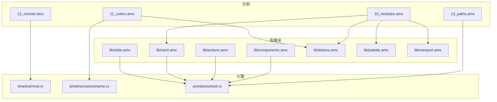
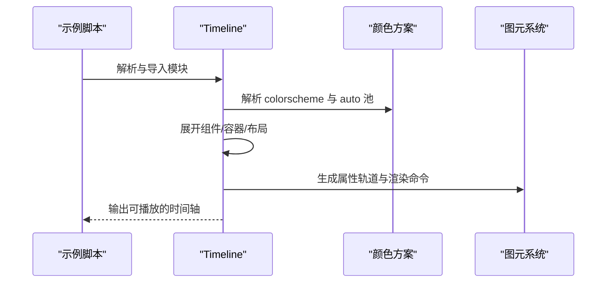
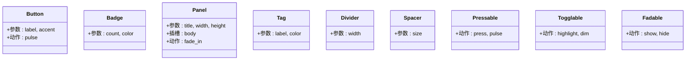
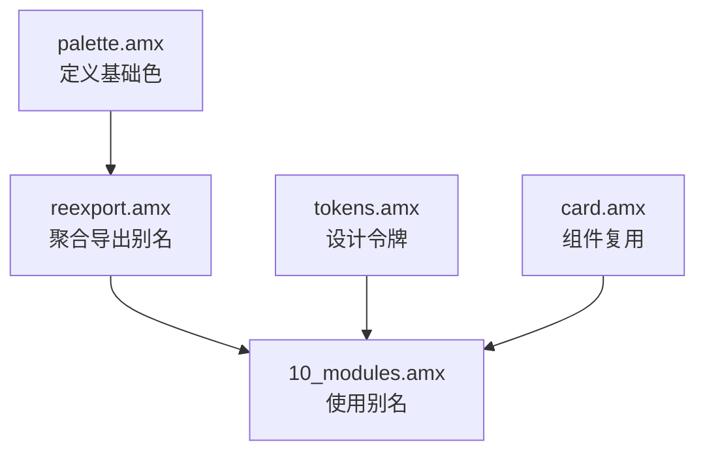
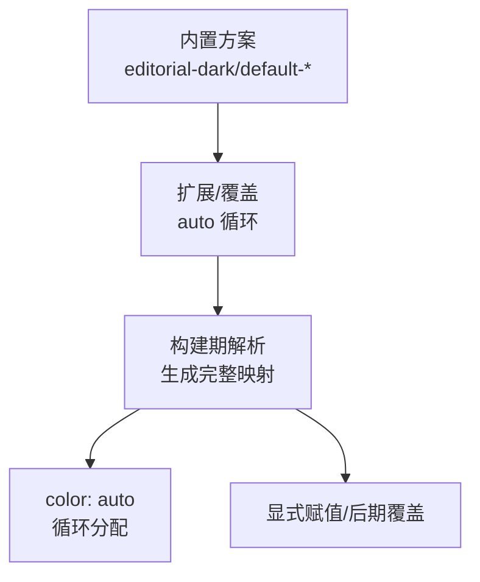
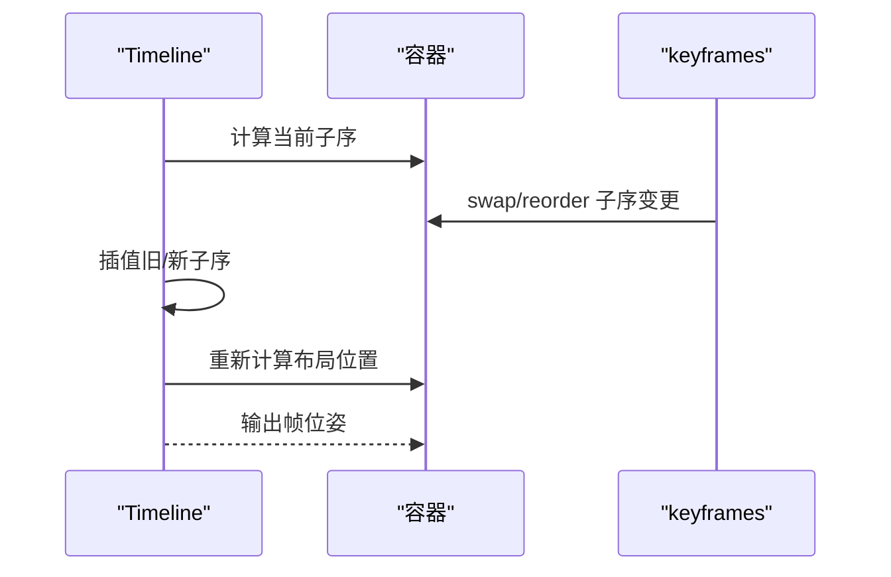
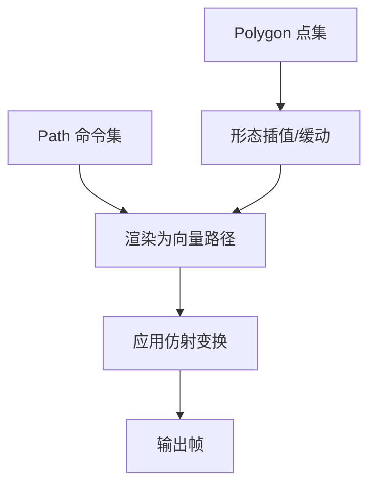
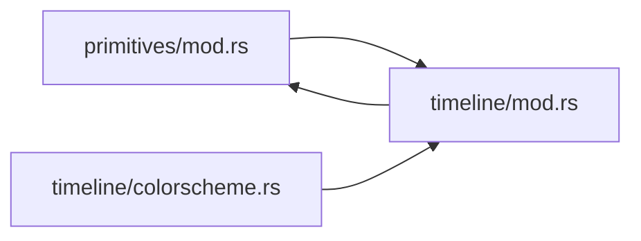

# 高级示例

<cite>
**本文引用的文件**   
- [examples/lib/components.amx](file://examples/lib/components.amx)
- [examples/lib/actions.amx](file://examples/lib/actions.amx)
- [examples/lib/card.amx](file://examples/lib/card.amx)
- [examples/lib/slide.amx](file://examples/lib/slide.amx)
- [examples/lib/tokens.amx](file://examples/lib/tokens.amx)
- [examples/lib/palette.amx](file://examples/lib/palette.amx)
- [examples/lib/reexport.amx](file://examples/lib/reexport.amx)
- [examples/10_modules.amx](file://examples/10_modules.amx)
- [examples/11_colors.amx](file://examples/11_colors.amx)
- [examples/12_reorder.amx](file://examples/12_reorder.amx)
- [examples/13_paths.amx](file://examples/13_paths.amx)
- [crates/animatix/src/timeline/mod.rs](file://crates/animatix/src/timeline/mod.rs)
- [crates/animatix/src/timeline/colorscheme.rs](file://crates/animatix/src/timeline/colorscheme.rs)
- [crates/animatix/src/primitives/mod.rs](file://crates/animatix/src/primitives/mod.rs)
</cite>

## 目录
1. [引言](#引言)
2. [项目结构](#项目结构)
3. [核心组件](#核心组件)
4. [架构总览](#架构总览)
5. [详细组件分析](#详细组件分析)
6. [依赖关系分析](#依赖关系分析)
7. [性能考量](#性能考量)
8. [故障排查指南](#故障排查指南)
9. [结论](#结论)
10. [附录](#附录)

## 引言
本文件面向希望深入掌握 Animatix 高级能力的开发者与设计者，围绕以下主题展开：组件系统与可复用模板、模块化导入导出与主题管理、颜色系统与语义化配色、动画重排与容器动态布局、复杂路径动画与矢量绘制。每个主题均结合示例场景与源码模块进行解析，并提供最佳实践建议。

## 项目结构
Animatix 的示例与引擎代码分层清晰：examples 下提供大量演示脚本；crates/animatix 提供运行时与编译期的核心实现（时间轴、图元系统、颜色方案等）。示例通过 import 语法组织模块，形成“主题/令牌/组件”三层可复用资产。

**图表来源**
- [examples/10_modules.amx:1-54](file://examples/10_modules.amx#L1-L54)
- [examples/11_colors.amx:1-76](file://examples/11_colors.amx#L1-L76)
- [examples/12_reorder.amx:1-41](file://examples/12_reorder.amx#L1-L41)
- [examples/13_paths.amx:1-50](file://examples/13_paths.amx#L1-L50)
- [crates/animatix/src/timeline/mod.rs:1-1093](file://crates/animatix/src/timeline/mod.rs#L1-L1093)
- [crates/animatix/src/timeline/colorscheme.rs:1-228](file://crates/animatix/src/timeline/colorscheme.rs#L1-L228)
- [crates/animatix/src/primitives/mod.rs:1-727](file://crates/animatix/src/primitives/mod.rs#L1-L727)

**章节来源**
- [examples/10_modules.amx:1-54](file://examples/10_modules.amx#L1-L54)
- [examples/11_colors.amx:1-76](file://examples/11_colors.amx#L1-L76)
- [examples/12_reorder.amx:1-41](file://examples/12_reorder.amx#L1-L41)
- [examples/13_paths.amx:1-50](file://examples/13_paths.amx#L1-L50)
- [crates/animatix/src/timeline/mod.rs:1-1093](file://crates/animatix/src/timeline/mod.rs#L1-L1093)
- [crates/animatix/src/timeline/colorscheme.rs:1-228](file://crates/animatix/src/timeline/colorscheme.rs#L1-L228)
- [crates/animatix/src/primitives/mod.rs:1-727](file://crates/animatix/src/primitives/mod.rs#L1-L727)

## 核心组件
- 组件系统：通过 pub component 定义可复用的 UI 原子与复合体，支持插槽（@slot）与动作（action）。
- 模块系统：import ... as 与 pub let 导出，支持 re-export 链与设计令牌。
- 颜色系统：内置颜色方案、auto 自动分配、语义别名与覆盖优先级。
- 动画重排：容器内子元素顺序交换与重排，配合缓动与交错。
- 路径动画：Path/Polygon 等矢量形状的命令式路径与形态变化。

**章节来源**
- [examples/lib/components.amx:1-64](file://examples/lib/components.amx#L1-L64)
- [examples/lib/actions.amx:1-50](file://examples/lib/actions.amx#L1-L50)
- [examples/lib/card.amx:1-13](file://examples/lib/card.amx#L1-L13)
- [examples/lib/slide.amx:1-16](file://examples/lib/slide.amx#L1-L16)
- [examples/lib/tokens.amx:1-58](file://examples/lib/tokens.amx#L1-L58)
- [examples/lib/palette.amx:1-9](file://examples/lib/palette.amx#L1-L9)
- [examples/lib/reexport.amx:1-5](file://examples/lib/reexport.amx#L1-L5)
- [examples/10_modules.amx:1-54](file://examples/10_modules.amx#L1-L54)
- [examples/11_colors.amx:1-76](file://examples/11_colors.amx#L1-L76)
- [examples/12_reorder.amx:1-41](file://examples/12_reorder.amx#L1-L41)
- [examples/13_paths.amx:1-50](file://examples/13_paths.amx#L1-L50)

## 架构总览
Animatix 的执行分为“构建期”与“帧评估期”。构建期将 AST 降级为 Timeline，生成属性轨道与布局信息；帧评估期按时间采样轨道、解析锚点与百分比位置、输出渲染场景。颜色系统在构建期解析颜色方案与自动分配池；容器布局在帧评估期根据子元素顺序与尺寸计算位置。

**图表来源**
- [crates/animatix/src/timeline/mod.rs:1-1093](file://crates/animatix/src/timeline/mod.rs#L1-L1093)
- [crates/animatix/src/timeline/colorscheme.rs:1-228](file://crates/animatix/src/timeline/colorscheme.rs#L1-L228)
- [crates/animatix/src/primitives/mod.rs:1-727](file://crates/animatix/src/primitives/mod.rs#L1-L727)

## 详细组件分析

### 组件系统与可复用模板
- 可复用组件：Button、Badge、Panel、Tag、Divider、Spacer 等，均以 pub component 定义，支持参数化与动作。
- 插槽机制：Panel 使用 @slot 注入自定义内容，便于组合不同主体。
- 动作封装：Pressable/Togglable/Fadable 将常用交互封装为动作，可在实例上直接触发。

**图表来源**
- [examples/lib/components.amx:1-64](file://examples/lib/components.amx#L1-L64)
- [examples/lib/actions.amx:1-50](file://examples/lib/actions.amx#L1-L50)
- [examples/lib/card.amx:1-13](file://examples/lib/card.amx#L1-L13)
- [examples/lib/slide.amx:1-16](file://examples/lib/slide.amx#L1-L16)

**章节来源**
- [examples/lib/components.amx:1-64](file://examples/lib/components.amx#L1-L64)
- [examples/lib/actions.amx:1-50](file://examples/lib/actions.amx#L1-L50)
- [examples/lib/card.amx:1-13](file://examples/lib/card.amx#L1-L13)
- [examples/lib/slide.amx:1-16](file://examples/lib/slide.amx#L1-L16)

### 模块系统：导入、导出与主题链
- 导入与命名空间：import "./lib/palette.amx" as palette，避免全局污染。
- 公共导出：pub let 在模块中导出常量，供其他脚本 import。
- re-export 链：通过中间模块聚合导出，形成主题别名（如 accent/bg/fg），便于跨文件统一使用。
- 设计令牌：tokens.amx 提供品牌色、语义别名、间距、字号、动画时长、圆角与阴影等，统一风格。

**图表来源**
- [examples/10_modules.amx:1-54](file://examples/10_modules.amx#L1-L54)
- [examples/lib/palette.amx:1-9](file://examples/lib/palette.amx#L1-L9)
- [examples/lib/reexport.amx:1-5](file://examples/lib/reexport.amx#L1-L5)
- [examples/lib/tokens.amx:1-58](file://examples/lib/tokens.amx#L1-L58)
- [examples/lib/card.amx:1-13](file://examples/lib/card.amx#L1-L13)

**章节来源**
- [examples/10_modules.amx:1-54](file://examples/10_modules.amx#L1-L54)
- [examples/lib/palette.amx:1-9](file://examples/lib/palette.amx#L1-L9)
- [examples/lib/reexport.amx:1-5](file://examples/lib/reexport.amx#L1-L5)
- [examples/lib/tokens.amx:1-58](file://examples/lib/tokens.amx#L1-L58)
- [examples/lib/card.amx:1-13](file://examples/lib/card.amx#L1-L13)

### 颜色系统：语义化、调色板与主题切换
- 内置颜色方案：default-dark、default-light、editorial-dark，提供场景背景、文本、表面、强调色与描边默认值。
- 主题继承：Colorscheme 支持 extends 基础方案，并可覆盖 auto 循环或保留基色。
- 运行时解析：构建期解析颜色方案，确定 color: auto 的分配序列，保证预览与导出一致性。
- 示例应用：11_colors.amx 展示了语义别名（accent.*、text.*、surface.*）、auto 分配与内置常量（red/green/blue/white/black）。

**图表来源**
- [examples/11_colors.amx:1-76](file://examples/11_colors.amx#L1-L76)
- [crates/animatix/src/timeline/colorscheme.rs:1-228](file://crates/animatix/src/timeline/colorscheme.rs#L1-L228)

**章节来源**
- [examples/11_colors.amx:1-76](file://examples/11_colors.amx#L1-L76)
- [crates/animatix/src/timeline/colorscheme.rs:1-228](file://crates/animatix/src/timeline/colorscheme.rs#L1-L228)

### 动画重排：容器动态布局与子序控制
- 容器动态布局：启用 dynamic_layout 后，容器子元素顺序可通过 child_orders 轨道驱动。
- 交换与重排：swap 与 reorder 动作在指定时间内改变子序，配合缓动函数实现顺滑过渡。
- 时间线联动：交错（stagger）与淡入（fade-in）等动作与重排同步，营造层次感。

**图表来源**
- [examples/12_reorder.amx:1-41](file://examples/12_reorder.amx#L1-L41)
- [crates/animatix/src/timeline/mod.rs:780-800](file://crates/animatix/src/timeline/mod.rs#L780-L800)

**章节来源**
- [examples/12_reorder.amx:1-41](file://examples/12_reorder.amx#L1-L41)
- [crates/animatix/src/timeline/mod.rs:780-800](file://crates/animatix/src/timeline/mod.rs#L780-L800)

### 复杂路径动画：命令式路径与形态变化
- Path 命令：move_to、line_to、quad_to、close 等命令式路径，适合精细控制曲线与折线。
- Polygon 形态变化：通过 points 切换实现多边形形态插值，配合缓动与变换矩阵。
- 变换矩阵：对 Path/Polygon 应用仿射变换（缩放、倾斜、旋转等），实现跟随路径的视觉效果。
- 文本路径提示：示例包含注释说明贝塞尔曲线、多边形与仿射变换的组合使用。

**图表来源**
- [examples/13_paths.amx:1-50](file://examples/13_paths.amx#L1-L50)
- [crates/animatix/src/primitives/mod.rs:1-727](file://crates/animatix/src/primitives/mod.rs#L1-L727)

**章节来源**
- [examples/13_paths.amx:1-50](file://examples/13_paths.amx#L1-L50)
- [crates/animatix/src/primitives/mod.rs:1-727](file://crates/animatix/src/primitives/mod.rs#L1-L727)

## 依赖关系分析
- 组件依赖图元系统：所有组件最终落于具体 Primitive（Rect/Ellipse/Text/Path 等），由 primitives/mod.rs 统一注册与调度。
- 颜色系统贯穿构建期：colorscheme.rs 在构建阶段解析方案与 auto 池，确保帧评估期无需重复计算。
- 时间线承载一切：timeline/mod.rs 负责容器元数据、布局缓存、子序动画与帧缓存，是重排与路径动画的执行中枢。

**图表来源**
- [crates/animatix/src/primitives/mod.rs:1-727](file://crates/animatix/src/primitives/mod.rs#L1-L727)
- [crates/animatix/src/timeline/mod.rs:1-1093](file://crates/animatix/src/timeline/mod.rs#L1-L1093)
- [crates/animatix/src/timeline/colorscheme.rs:1-228](file://crates/animatix/src/timeline/colorscheme.rs#L1-L228)

**章节来源**
- [crates/animatix/src/primitives/mod.rs:1-727](file://crates/animatix/src/primitives/mod.rs#L1-L727)
- [crates/animatix/src/timeline/mod.rs:1-1093](file://crates/animatix/src/timeline/mod.rs#L1-L1093)
- [crates/animatix/src/timeline/colorscheme.rs:1-228](file://crates/animatix/src/timeline/colorscheme.rs#L1-L228)

## 性能考量
- 构建质量等级：Draft（GUI 实时编辑）、Preview（暂停/拖拽预览）、Production（导出），影响绘图采样精度与速度。
- 布局缓存：容器布局结果按子序快照缓存，避免重复 Taffy 计算。
- 帧缓存与静态子树缓存：相同时间与尺寸下跳过重复评估；静态子树片段可复用。
- 变换缓存：按时间戳与父变换系数缓存节点变换，提升连续帧一致性与效率。

**章节来源**
- [crates/animatix/src/timeline/mod.rs:150-190](file://crates/animatix/src/timeline/mod.rs#L150-L190)
- [crates/animatix/src/timeline/mod.rs:316-354](file://crates/animatix/src/timeline/mod.rs#L316-L354)
- [crates/animatix/src/timeline/mod.rs:429-502](file://crates/animatix/src/timeline/mod.rs#L429-L502)

## 故障排查指南
- 颜色方案无效：检查 colorscheme 名称是否正确、auto 循环是否为空、覆盖顺序是否导致被覆盖。
- 子序重排异常：确认容器已启用 dynamic_layout，且 swap/reorder 的目标子元素存在且可布局。
- 路径动画不生效：核对 Path/Polygon 的命令/点集是否闭合或合法，仿射变换矩阵是否有效。
- 模块导入失败：确认 import 路径与别名拼写，pub let 是否导出，re-export 链是否完整。

**章节来源**
- [crates/animatix/src/timeline/colorscheme.rs:160-205](file://crates/animatix/src/timeline/colorscheme.rs#L160-L205)
- [crates/animatix/src/timeline/mod.rs:780-800](file://crates/animatix/src/timeline/mod.rs#L780-L800)
- [examples/13_paths.amx:1-50](file://examples/13_paths.amx#L1-L50)
- [examples/10_modules.amx:1-54](file://examples/10_modules.amx#L1-L54)

## 结论
通过组件化、模块化与颜色系统，Animatix 能够高效组织大型项目的动画资源并保持一致的视觉语言。结合容器动态布局与路径动画，可以实现复杂的交互与表现。遵循本文的最佳实践，可在保证性能的同时获得可维护、可扩展的动画工程体系。

## 附录
- 最佳实践清单
  - 使用 tokens.amx 统一品牌色与语义别名，减少硬编码。
  - 通过 re-export 链暴露主题别名，避免跨文件散落的导入。
  - 在 colorscheme 中定义 auto 循环，配合 color: auto 减少手动配色。
  - 对频繁重排的容器开启 dynamic_layout，并用 swap/reorder 控制子序。
  - 使用 Path/Polygon 命令与仿射变换实现跟随路径与变形效果，注意缓动与采样质量平衡。