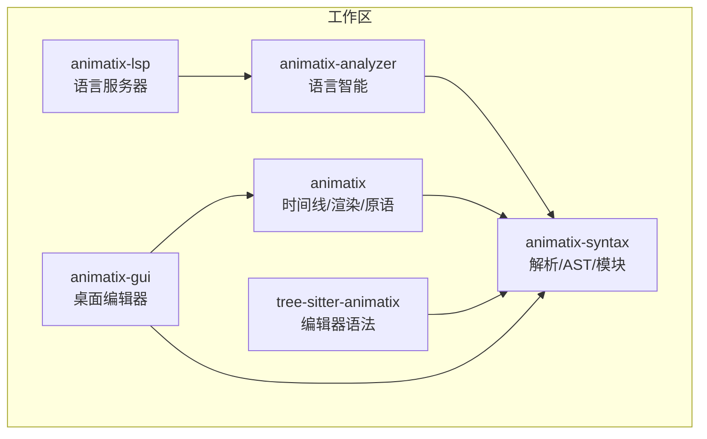
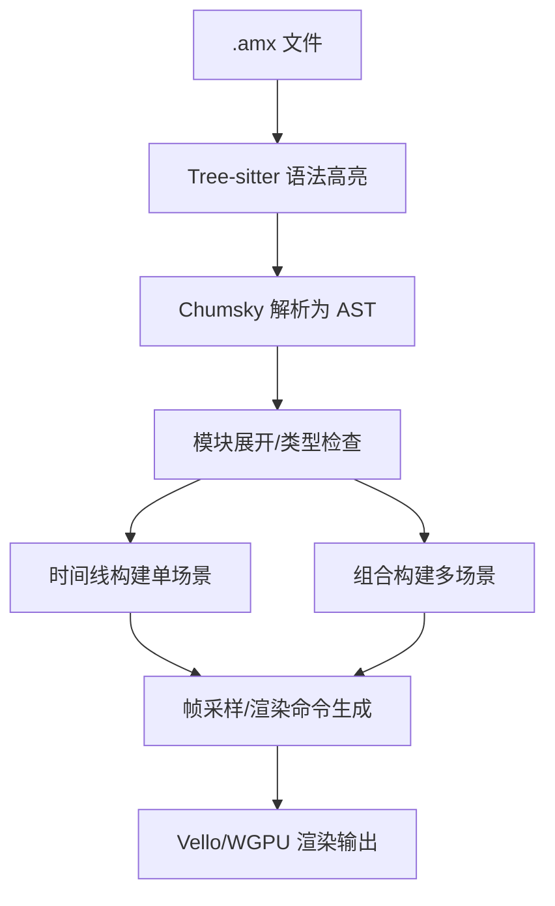
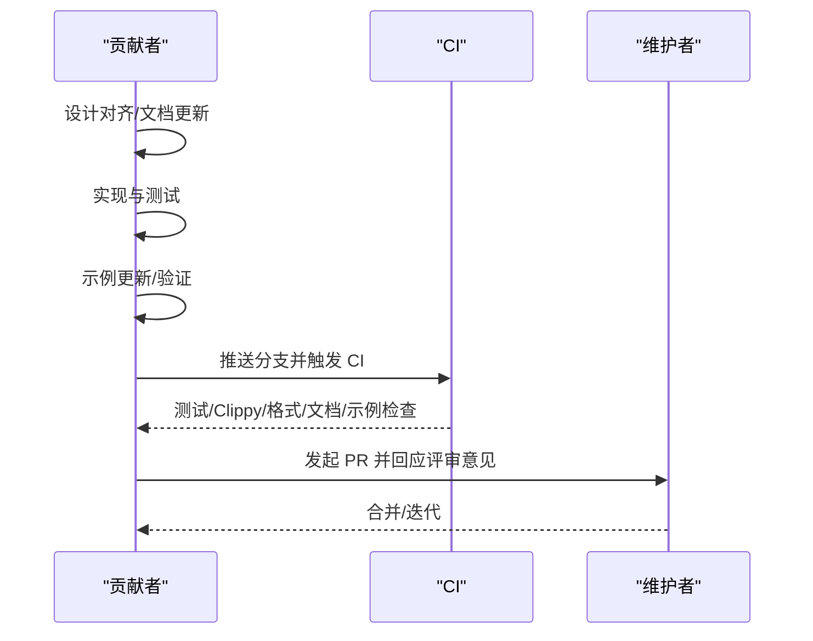
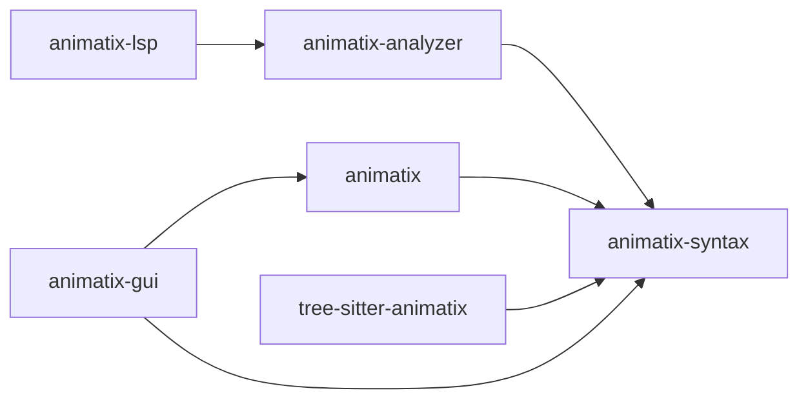

# 社区与贡献

<cite>
**本文引用的文件**
- [CONTRIBUTING.md](file://CONTRIBUTING.md)
- [Readme.md](file://Readme.md)
- [docs/contributing.md](file://docs/contributing.md)
- [docs/spec.md](file://docs/spec.md)
- [docs/architecture.md](file://docs/architecture.md)
- [docs/roadmap.md](file://docs/roadmap.md)
- [PLAN.md](file://PLAN.md)
- [.github/workflows/ci.yml](file://.github/workflows/ci.yml)
- [clippy.toml](file://clippy.toml)
- [rustfmt.toml](file://rustfmt.toml)
- [Cargo.toml](file://Cargo.toml)
- [cog.toml](file://cog.toml)
</cite>

## 目录
1. [引言](#引言)
2. [项目结构](#项目结构)
3. [核心组件](#核心组件)
4. [架构总览](#架构总览)
5. [详细组件分析](#详细组件分析)
6. [依赖关系分析](#依赖关系分析)
7. [性能考量](#性能考量)
8. [故障排查指南](#故障排查指南)
9. [结论](#结论)
10. [附录](#附录)

## 引言
本指南面向所有希望参与 Animatix 开发与维护的贡献者，系统化介绍贡献流程、代码规范、质量标准、开发环境搭建、问题认领与功能开发流程、社区行为准则与沟通渠道、路线图与发展规划，以及问题报告与功能请求的标准模板与处理流程。目标是帮助新老贡献者快速上手、高效协作，并确保变更在设计、实现、测试、示例与文档之间保持一致。

## 项目结构
Animatix 采用多 crate 工作区组织，围绕“语法层（解析/AST）—运行时（时间线/渲染）—工具链（GUI/LSP/编辑器语法）”三层能力展开。核心模块包括：
- 语法与模块：animatix-syntax（解析、AST、模块系统）
- 运行时引擎：animatix（时间线、动作、变形、绘图、渲染）
- 分析与语言智能：animatix-analyzer（符号表、补全、诊断等）
- LSP 服务：animatix-lsp（基于 tower-lsp 的语言服务器）
- 桌面 GUI：animatix-gui（基于 egui 的可视化编辑器）
- 编辑器语法：tree-sitter-animatix（Tree-sitter 语法包）

图表来源
- [Cargo.toml:1-11](file://Cargo.toml#L1-L11)

章节来源
- [Cargo.toml:1-11](file://Cargo.toml#L1-L11)
- [docs/contributing.md:65-118](file://docs/contributing.md#L65-L118)

## 核心组件
- 贡献流程与验证清单：遵循“先对齐设计，再更新文档，然后实现与测试，最后验证与示例”的顺序；强调用户可见表面变更需同步文档与示例。
- 实现质量期望：可读、明确命名、避免不必要抽象、不掩盖类型/编译器问题、根因修复而非层层补丁。
- 文档同步规则：Readme、spec、primitives、architecture、roadmap、examples、tree-sitter-animatix 的 README 需与变更保持一致。
- 测试与示例：单元测试覆盖解析、AST、时间线、变形/路径逻辑、模块导入、Tree-sitter 语法高亮；示例需可运行且与当前运行时一致。
- 提交规范：Conventional Commits，使用 Cocogitto 校验；scope 限定在 animatix/gui/analyzer/lsp/syntax/parser/renderer/timeline/ci/docs 等。

章节来源
- [CONTRIBUTING.md:5-181](file://CONTRIBUTING.md#L5-L181)
- [docs/contributing.md:14-333](file://docs/contributing.md#L14-L333)

## 架构总览
Animatix 的文件处理管线从 .amx 到 AST，再到时间线构建与多场景组合，最终由渲染后端输出图像或视频。GUI 通过 AST 变更回写源码，保证格式化与一致性。

图表来源
- [docs/architecture.md:14-53](file://docs/architecture.md#L14-L53)

章节来源
- [docs/architecture.md:1-757](file://docs/architecture.md#L1-L757)

## 详细组件分析

### 贡献流程与 Pull Request 审核
- 变更顺序：设计对齐 → 文档更新 → 实现与测试 → 示例更新 → 验证
- 非 trivial 变更：先明确设计预期，再逐步推进到实现、测试、示例与验证
- 文档与示例同步：若影响用户可见语法表面，文档与示例需随代码一并落地
- 提交信息：Conventional Commits，范围限定，使用 cocogitto 校验

图表来源
- [.github/workflows/ci.yml:10-116](file://.github/workflows/ci.yml#L10-L116)
- [docs/contributing.md:284-333](file://docs/contributing.md#L284-L333)

章节来源
- [CONTRIBUTING.md:5-181](file://CONTRIBUTING.md#L5-L181)
- [docs/contributing.md:284-333](file://docs/contributing.md#L284-L333)
- [.github/workflows/ci.yml:10-116](file://.github/workflows/ci.yml#L10-L116)

### 代码规范与质量标准
- Rust 风格与格式化：使用 rustfmt，配置最大行长、导入分组、注释宽度等
- Clippy 规则：CI 中以 -D warnings 执行；允许部分结构性阈值临时放宽（见 roadmap P1.3/P1.4）
- 注释原则：解释“为何”而非重复代码；标注非显式不变量、运行时/解析器差异、渲染/时间线约束与权衡
- 代码可读性：清晰命名、避免不必要的抽象、根因修复

章节来源
- [rustfmt.toml:1-25](file://rustfmt.toml#L1-L25)
- [clippy.toml:1-11](file://clippy.toml#L1-L11)
- [CONTRIBUTING.md:58-78](file://CONTRIBUTING.md#L58-L78)

### 开发环境搭建与本地验证
- 快速起步：cargo build 与 cargo test
- 语法/工具链验证：进入 tree-sitter-animatix，执行 generate/test/highlight
- 常用 CLI：ast、render、image、video、gif；支持 --loop、--time、--duration、--fps、--width/--height 等参数
- GUI：cargo run --bin animatix-gui -- <示例文件>

章节来源
- [Readme.md:59-99](file://Readme.md#L59-L99)
- [docs/contributing.md:16-62](file://docs/contributing.md#L16-L62)

### 新贡献者入门指导
- 选择任务：从 examples/README.md 的示例入手，确认其与运行时一致；查看 docs/spec.md 的状态矩阵与 roadmap.md 的计划项
- 认领问题：优先选择与自身技能匹配且文档/示例未落后的任务；避免遗留“仅语法/未运行时”的特性
- 开发流程：先设计与文档对齐，再实现与测试，最后补充示例与验证
- 提交流程：遵循 Conventional Commits，使用 cocogitto；PR 通过 CI（测试、Clippy、格式、文档、示例）后由维护者审核

章节来源
- [Readme.md:114-178](file://Readme.md#L114-L178)
- [docs/contributing.md:14-62](file://docs/contributing.md#L14-L62)
- [docs/spec.md:22-63](file://docs/spec.md#L22-L63)
- [docs/roadmap.md:1-44](file://docs/roadmap.md#L1-L44)

### 社区行为准则与沟通渠道
- 行为准则：尊重、包容、建设性反馈；聚焦问题与改进方案
- 沟通渠道：GitHub Issues/Pull Requests；讨论中请附带最小可复现示例与预期/实际行为说明
- 评审与合并：维护者负责代码质量与一致性把关；PR 需满足 CI 与文档/示例同步要求

（本节为通用社区实践说明，不直接分析具体文件）

### 路线图与发展规划
- 当前重点：保持已文档化的语言表面一致性，扩展已有契约下的运行时能力，改善 GUI/编辑体验，避免过度承诺未完成语法
- 迁移计划示例：标准化列表与元组语法的迁移计划，按阶段推进 AST、解析、格式化、类型系统、运行时与示例/文档更新
- 冰山项与待评估：部分需求作为未来考虑，暂不纳入近期实施计划

章节来源
- [Readme.md:173-178](file://Readme.md#L173-L178)
- [docs/roadmap.md:1-44](file://docs/roadmap.md#L1-L44)
- [PLAN.md:1-60](file://PLAN.md#L1-L60)

### 问题报告与功能请求模板
- 问题报告模板建议字段：
  - 复现步骤（最小可复现示例）
  - 预期行为与实际行为
  - 版本信息（Rust/Animatix/OS）
  - 相关日志/截图
  - 影响范围（示例/语法/运行时/GUI）
- 功能请求模板建议字段：
  - 使用场景与动机
  - 期望的语法/行为描述
  - 与现有能力的关系（是否破坏兼容）
  - 是否已有替代方案
  - 对文档/示例的影响

（本节为通用模板建议，不直接分析具体文件）

## 依赖关系分析
- 工作区成员：animatix、animatix-analyzer、animatix-gui、animatix-lsp、animatix-syntax、tree-sitter-animatix
- CI 任务：测试、Clippy、格式检查、文档构建、依赖审计、示例校验、Conventional Commits 校验
- 依赖拆分：animatix-syntax 从核心引擎中独立，降低 LSP 编译图复杂度

图表来源
- [Cargo.toml:1-11](file://Cargo.toml#L1-L11)
- [docs/architecture.md:733-757](file://docs/architecture.md#L733-L757)

章节来源
- [Cargo.toml:1-11](file://Cargo.toml#L1-L11)
- [.github/workflows/ci.yml:10-116](file://.github/workflows/ci.yml#L10-L116)
- [docs/architecture.md:733-757](file://docs/architecture.md#L733-L757)

## 性能考量
- 运行时与渲染：时间线构建与采样、布局系统、滤镜后处理（当前 CPU 管线存在 GPU→CPU 读回瓶颈，正在向 GPU 计算管线演进）
- GUI 与编辑器：AST 变更回写、增量重建、预览渲染与热重载
- 优化方向：减少不必要的抽象、避免死分支、保持小而垂直的变更切片、关注类型与编译器提示

（本节提供一般性指导，不直接分析具体文件）

## 故障排查指南
- 常见问题定位：
  - 解析错误：使用 cargo run --bin animatix -- ast <文件> 查看 AST；必要时 --compact 快速对比
  - 时间线/帧级问题：使用 image 子命令在特定时刻导出帧进行验证
  - 视频/动图导出：使用 video/gif 子命令，设置 fps/duration/分辨率
  - 语法高亮与语法包：在 tree-sitter-animatix 下执行 generate/test/highlight
- CI 失败排查：按 CI job 分别检查测试、Clippy、格式、文档、示例与提交信息

章节来源
- [CONTRIBUTING.md:118-178](file://CONTRIBUTING.md#L118-L178)
- [.github/workflows/ci.yml:10-116](file://.github/workflows/ci.yml#L10-L116)

## 结论
通过统一的设计-文档-实现-测试-示例-验证流程、严格的代码规范与 CI 保障、清晰的路线图与沟通渠道，Animatix 希望为贡献者提供高效、可持续的协作体验。欢迎新老贡献者一起推动动画语言与渲染系统的演进。

## 附录

### 提交信息规范与校验
- 类型与范围：feat、fix、docs、style、refactor、perf、test、build、ci、chore、revert；范围限定在项目内常见模块
- 校验工具：cocogitto，CI 中通过 cog check 强制校验

章节来源
- [docs/contributing.md:284-333](file://docs/contributing.md#L284-L333)
- [cog.toml:1-24](file://cog.toml#L1-L24)

### 语言规范与状态矩阵
- 语言状态矩阵：区分 Parser（语法接受）、Runtime-real（端到端执行）、Tests（自动化证据）、Docs（文档）
- 关键领域：反应式（always/for）、组件与模块、表达式、原语、绘图、动作、组合、颜色方案、多场景等

章节来源
- [docs/spec.md:22-63](file://docs/spec.md#L22-L63)