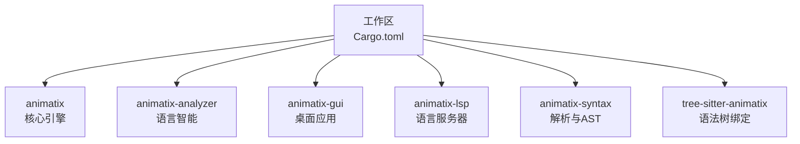
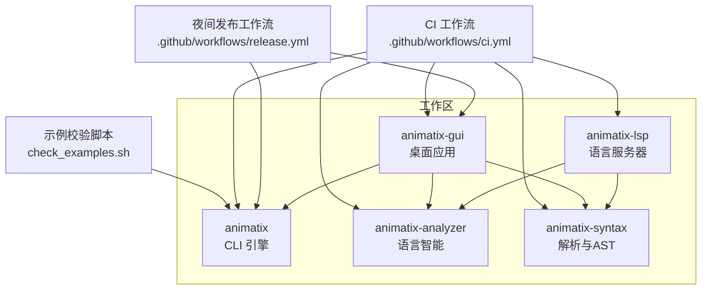
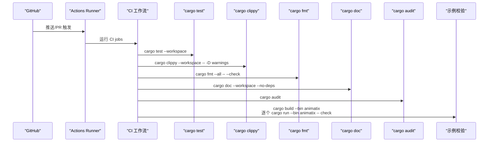
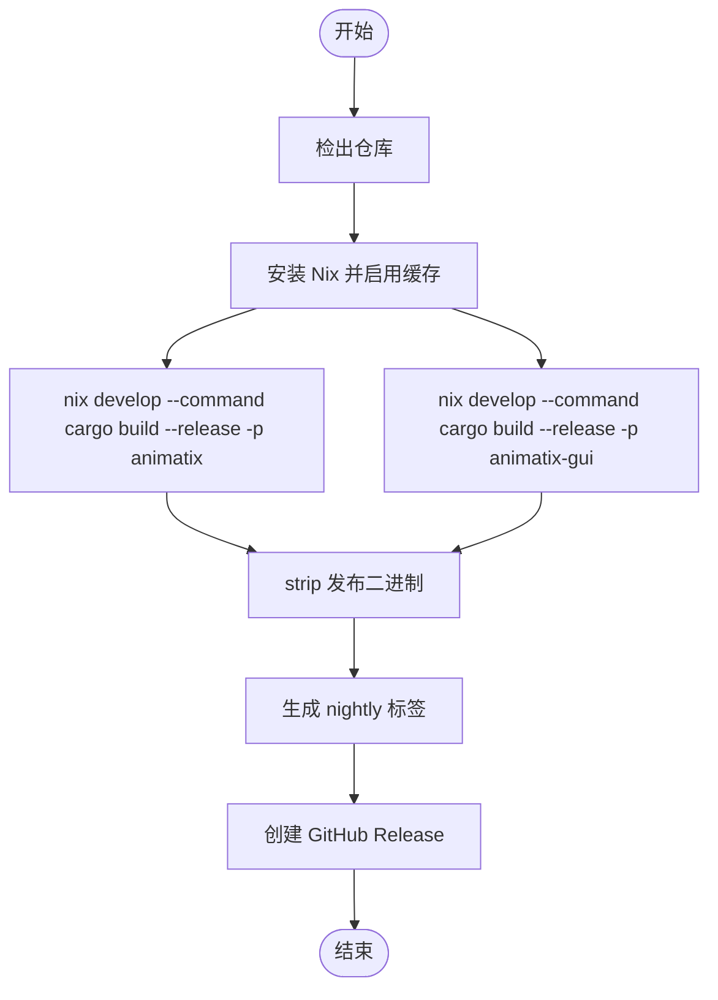
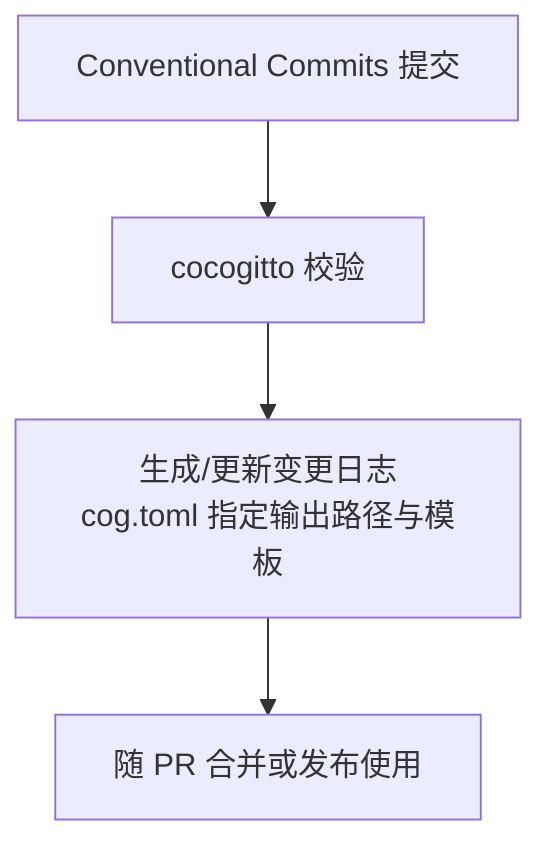
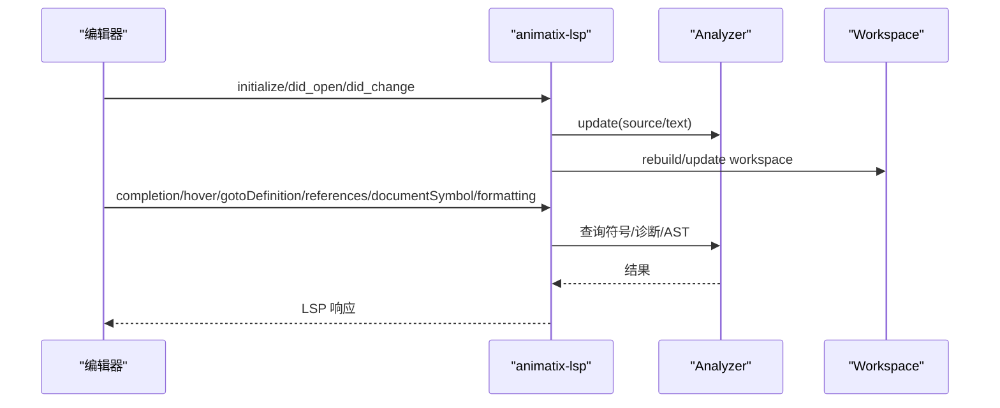
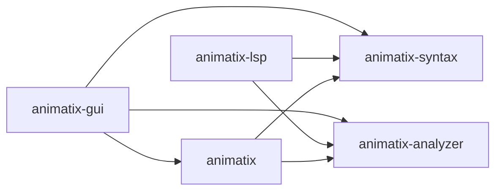

# 部署与运维

<cite>
**本文引用的文件**
- [Cargo.toml](file://Cargo.toml)
- [ci.yml](file://.github/workflows/ci.yml)
- [release.yml](file://.github/workflows/release.yml)
- [cog.toml](file://cog.toml)
- [clippy.toml](file://clippy.toml)
- [rustfmt.toml](file://rustfmt.toml)
- [flake.nix](file://flake.nix)
- [check_examples.sh](file://scripts/check_examples.sh)
- [animatix/Cargo.toml](file://crates/animatix/Cargo.toml)
- [animatix-gui/Cargo.toml](file://crates/animatix-gui/Cargo.toml)
- [animatix-analyzer/src/lib.rs](file://crates/animatix-analyzer/src/lib.rs)
- [animatix-syntax/src/lib.rs](file://crates/animatix-syntax/src/lib.rs)
- [animatix-lsp/src/main.rs](file://crates/animatix-lsp/src/main.rs)
- [animatix/src/lib.rs](file://crates/animatix/src/lib.rs)
</cite>

## 目录
1. [简介](#简介)
2. [项目结构](#项目结构)
3. [核心组件](#核心组件)
4. [架构总览](#架构总览)
5. [详细组件分析](#详细组件分析)
6. [依赖关系分析](#依赖关系分析)
7. [性能考量](#性能考量)
8. [故障排查指南](#故障排查指南)
9. [结论](#结论)
10. [附录](#附录)

## 简介
本指南面向运维与开发团队，系统性说明 Animatix 在本地与 CI 环境中的构建、测试、格式化、文档生成、安全审计、示例校验与夜间发布流程；覆盖 Cargo 工作区管理、依赖版本控制策略、跨平台构建支持（通过 Nix）以及基于 GitHub Actions 的持续集成与持续部署配置。同时给出不同环境（开发、测试、生产）的部署策略建议、版本与发布管理方法（含语义化版本与变更日志），并提供监控与日志管理最佳实践。

## 项目结构
Animatix 采用多 crate 的工作区组织方式，核心模块包括动画引擎、语法与类型检查、语言服务器、GUI 应用等。根目录的 Cargo 工作区统一管理成员 crate，并指定解析器版本以确保依赖解析一致性。

图表来源
- [Cargo.toml:1-11](file://Cargo.toml#L1-L11)

章节来源
- [Cargo.toml:1-11](file://Cargo.toml#L1-L11)

## 核心组件
- 动画引擎与渲染：负责时间线、中间表示、修饰器字节码虚拟机、渲染后端（Vello/WGPU）等。
- 语法与类型检查：提供解析、AST、格式化、增量符号表、类型检查与诊断。
- 语言服务器：为外部编辑器提供补全、悬停、跳转定义、引用、文档符号等 LSP 能力。
- GUI 应用：基于 eframe/egui 的桌面应用，提供预览、编辑、导出等功能。
- 分析器：为 GUI 与 LSP 提供语言智能能力，支持增量更新与跨文件符号解析。

章节来源
- [animatix/src/lib.rs:1-24](file://crates/animatix/src/lib.rs#L1-L24)
- [animatix-syntax/src/lib.rs:1-29](file://crates/animatix-syntax/src/lib.rs#L1-L29)
- [animatix-analyzer/src/lib.rs:1-800](file://crates/animatix-analyzer/src/lib.rs#L1-L800)
- [animatix-lsp/src/main.rs:1-509](file://crates/animatix-lsp/src/main.rs#L1-L509)

## 架构总览
下图展示从源码到可执行产物的关键路径：CLI 与 GUI 均由工作区统一构建；GUI 依赖引擎与分析器；LSP 依赖分析器与语法模块；示例校验脚本与 CI 流水线共同保障质量门禁。

图表来源
- [ci.yml:1-116](file://.github/workflows/ci.yml#L1-L116)
- [release.yml:1-56](file://.github/workflows/release.yml#L1-L56)
- [check_examples.sh:1-25](file://scripts/check_examples.sh#L1-L25)
- [animatix/Cargo.toml:1-105](file://crates/animatix/Cargo.toml#L1-L105)
- [animatix-gui/Cargo.toml:1-49](file://crates/animatix-gui/Cargo.toml#L1-L49)

## 详细组件分析

### CI 持续集成流水线
- 触发条件：拉取请求触发。
- 关键作业：
  - 测试：在 Ubuntu 最新环境中安装系统依赖（FFmpeg、pkg-config），执行工作区测试。
  - Clippy：启用 clippy 组件，对工作区进行静态检查并把警告视为错误。
  - 格式化：使用 rustfmt 检查代码风格。
  - 文档：构建无依赖文档并把警告视为错误。
  - 审计：安装 cargo-audit 并执行依赖安全审计。
  - 示例校验：构建 CLI 后遍历示例文件，逐一执行校验命令。
  - Conventional Commits：安装 cocogitto 并校验提交信息是否符合约定式提交规范。

图表来源
- [ci.yml:1-116](file://.github/workflows/ci.yml#L1-L116)

章节来源
- [ci.yml:1-116](file://.github/workflows/ci.yml#L1-L116)

### 夜间发布流水线
- 触发条件：手动触发（workflow_dispatch）。
- 步骤概要：
  - 安装 Nix 并启用魔法缓存与 Rust 缓存。
  - 使用 Nix 开发环境构建 CLI 与 GUI 的发布二进制。
  - 对二进制进行 strip。
  - 生成“nightly-YYMMDD-HHMM”标签并创建 GitHub Release，附带两个二进制文件与自动生成的发行说明。

图表来源
- [release.yml:1-56](file://.github/workflows/release.yml#L1-L56)

章节来源
- [release.yml:1-56](file://.github/workflows/release.yml#L1-L56)

### 版本与变更日志管理
- Conventional Commits 规范：通过 cocogitto 校验 PR 提交信息，保证变更可追溯。
- 变更日志：使用 cog 配置输出到 CHANGELOG.md，模板为 remote。
- 作用域：涵盖 animatix、gui、analyzer、lsp、syntax、parser、renderer、timeline、ci、docs 等范围。

图表来源
- [cog.toml:1-24](file://cog.toml#L1-L24)

章节来源
- [cog.toml:1-24](file://cog.toml#L1-L24)

### 代码风格与静态检查
- 格式化：rustfmt 配置统一风格，限制行长、导入分组与注释宽度。
- 静态检查：Clippy 配置最低 Rust 版本与允许的 lint 阈值，CI 中将警告视为错误。

章节来源
- [rustfmt.toml:1-25](file://rustfmt.toml#L1-L25)
- [clippy.toml:1-11](file://clippy.toml#L1-L11)

### 依赖与特性管理
- 工作区统一解析器版本，确保跨 crate 依赖解析一致。
- 引擎 crate 提供渲染、视频、文本、SVG 等可选特性，按需启用。
- GUI crate 依赖引擎与分析器，集成 eframe/egui、WGPU、音频与文件系统工具。

章节来源
- [Cargo.toml:1-11](file://Cargo.toml#L1-L11)
- [animatix/Cargo.toml:1-105](file://crates/animatix/Cargo.toml#L1-L105)
- [animatix-gui/Cargo.toml:1-49](file://crates/animatix-gui/Cargo.toml#L1-L49)

### 跨平台构建支持
- Nix 开发壳：集中安装 FFmpeg、pkg-config、Vulkan、Wayland、X11、clang、nodejs、tree-sitter 等系统依赖，统一构建环境。
- Vulkan ICD/Layer 路径：通过环境变量注入，便于在 Linux 上运行图形与音频相关功能。
- CI 与发布：CI 使用 Ubuntu runner 安装系统依赖；夜间发布通过 Nix 在受控环境中构建。

章节来源
- [flake.nix:1-60](file://flake.nix#L1-L60)
- [ci.yml:17-21](file://.github/workflows/ci.yml#L17-L21)
- [release.yml:19-29](file://.github/workflows/release.yml#L19-L29)

### 示例校验与回归
- 本地脚本：遍历 examples 目录，调用 CLI 的 check 子命令验证示例文件。
- CI：在构建 CLI 后执行相同校验逻辑，失败时整体退出码非零，阻止合并。

章节来源
- [check_examples.sh:1-25](file://scripts/check_examples.sh#L1-L25)
- [ci.yml:79-102](file://.github/workflows/ci.yml#L79-L102)

### 语言服务器与编辑器集成
- LSP 服务：基于 tokio 与 tower-lsp，提供补全、悬停、跳转定义、引用、文档符号、格式化等能力。
- 工作空间：根据打开的文档动态重建工作空间，支持跨文件符号解析与增量更新。

图表来源
- [animatix-lsp/src/main.rs:1-509](file://crates/animatix-lsp/src/main.rs#L1-L509)
- [animatix-analyzer/src/lib.rs:1-800](file://crates/animatix-analyzer/src/lib.rs#L1-L800)

## 依赖关系分析
- 内部依赖：
  - GUI 依赖 animatix、animatix-analyzer、animatix-syntax。
  - LSP 依赖 animatix-analyzer、animatix-syntax。
  - animatix 依赖 animatix-syntax 与 animatix-analyzer。
- 外部依赖：
  - 渲染：wgpu、vello、bytemuck、pollster。
  - 视频：rsmpeg、image。
  - 文本：typst、typst-layout、fontdb、ttf-parser。
  - SVG：usvg、roxmltree。
  - 语法树：tree-sitter、tree-sitter-animatix。
  - 图形与音频：Vulkan、Wayland、X11、pipewire、alsa。
- 特性开关：通过 features 控制可选功能，避免不必要的编译与运行时开销。

图表来源
- [animatix-gui/Cargo.toml:13-38](file://crates/animatix-gui/Cargo.toml#L13-L38)
- [animatix/Cargo.toml:14-37](file://crates/animatix/Cargo.toml#L14-L37)
- [animatix-lsp/src/main.rs:6-13](file://crates/animatix-lsp/src/main.rs#L6-L13)

章节来源
- [animatix-gui/Cargo.toml:13-38](file://crates/animatix-gui/Cargo.toml#L13-L38)
- [animatix/Cargo.toml:14-37](file://crates/animatix/Cargo.toml#L14-L37)
- [animatix-lsp/src/main.rs:6-13](file://crates/animatix-lsp/src/main.rs#L6-L13)

## 性能考量
- 构建缓存：CI 与夜间发布均使用 Swatinem/rust-cache 与 Nix 魔法缓存，显著缩短构建时间。
- 二进制优化：夜间发布阶段 strip 二进制，减小体积。
- 依赖裁剪：通过特性开关按需启用渲染、视频、文本、SVG 等功能，避免冗余依赖。
- 并行与增量：LSP 与分析器支持增量更新与跨文件工作空间，降低编辑器响应延迟。

章节来源
- [ci.yml:16](file://.github/workflows/ci.yml#L16)
- [release.yml:25-37](file://.github/workflows/release.yml#L25-L37)
- [animatix/Cargo.toml:7-12](file://crates/animatix/Cargo.toml#L7-L12)

## 故障排查指南
- CI 失败定位
  - 测试失败：检查测试日志中具体 crate 的错误堆栈，确认是否为示例文件或引擎问题。
  - Clippy 失败：关注警告被视作错误的规则，优先修复高风险问题。
  - 格式化失败：运行本地 rustfmt 校正，确保与 CI 配置一致。
  - 文档构建失败：检查 RUSTDOCFLAGS 与依赖缺失，确保无未声明的外部链接。
  - 审计失败：查看 cargo-audit 报告，升级存在安全风险的依赖版本。
  - 示例校验失败：逐个定位失败示例，结合引擎的解析与类型检查输出定位问题。
- LSP 与编辑器
  - 若符号解析异常，检查工作空间是否正确重建（打开/关闭/修改文件后）。
  - 若格式化无效，确认 Formatter 是否检测到 AST 差异。
- 夜间发布
  - 若 Nix 缓存失效，清理缓存后重试；确认系统依赖已安装。
  - 若 strip 失败，检查目标路径与权限。

章节来源
- [ci.yml:21-116](file://.github/workflows/ci.yml#L21-L116)
- [release.yml:19-56](file://.github/workflows/release.yml#L19-L56)
- [animatix-lsp/src/main.rs:65-100](file://crates/animatix-lsp/src/main.rs#L65-L100)

## 结论
通过工作区统一管理、Nix 跨平台构建、严格的 CI 质量门禁与约定式提交驱动的变更日志，Animatix 实现了可复现、可审计且易于扩展的交付体系。夜间发布流水线进一步降低了手工操作成本，配合示例校验与安全审计，保障了质量与稳定性。运维团队可据此在不同环境（开发、测试、生产）中复用相同的流程与工具链，实现一致的部署体验。

## 附录

### 不同环境的部署策略建议
- 开发环境
  - 使用 Nix 开发壳一键安装系统依赖与工具链，确保本地与 CI 环境一致。
  - 通过 cargo run 或 cargo build 快速迭代引擎与 GUI。
- 测试环境
  - 使用 CI 的测试与审计作业作为准入标准；示例校验必须全部通过。
  - 可在测试机上运行 strip 后的发布二进制，模拟生产体积与行为。
- 生产环境
  - 优先使用夜间发布的二进制，配合变更日志与标签进行追踪。
  - 在 Linux 上确保 Vulkan ICD/Layer 路径正确，音频通过 pipewire/alsa 正常加载。

章节来源
- [flake.nix:19-56](file://flake.nix#L19-L56)
- [release.yml:34-53](file://.github/workflows/release.yml#L34-L53)

### 版本与发布管理
- 版本策略：遵循语义化版本，结合 Conventional Commits 自动化生成变更日志。
- 发布节奏：当前采用夜间发布，标签格式为 nightly-YYMMDD-HHMM；可按需调整为每日/每周固定时间。
- 变更日志：通过 cog 配置输出至 CHANGELOG.md，便于发布说明与用户沟通。

章节来源
- [cog.toml:17-24](file://cog.toml#L17-L24)
- [release.yml:39-53](file://.github/workflows/release.yml#L39-L53)

### 监控与日志管理最佳实践
- 日志
  - 使用 tracing 与 tracing-subscriber 记录运行期事件，结合 env-filter 在不同环境切换日志级别。
- 性能
  - 利用基准测试（benchmarks）定期评估时间线求值、属性插值、修饰器运行时等关键路径性能。
- 可观测性
  - 在 GUI 与 LSP 中暴露关键指标（如解析耗时、符号查询耗时、工作空间重建频率），辅助定位性能瓶颈。
- 安全
  - 持续运行 cargo-audit，及时发现并修复依赖漏洞；在 CI 中强制执行。

章节来源
- [animatix/Cargo.toml:37-37](file://crates/animatix/Cargo.toml#L37-L37)
- [animatix-gui/Cargo.toml:32-32](file://crates/animatix-gui/Cargo.toml#L32-L32)
- [ci.yml:67-78](file://.github/workflows/ci.yml#L67-L78)