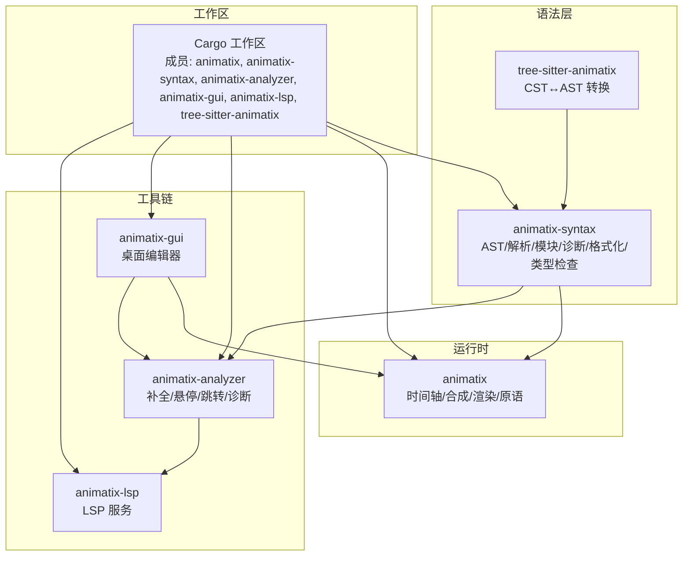
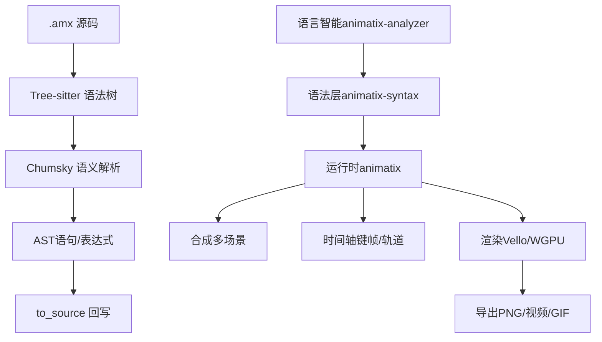
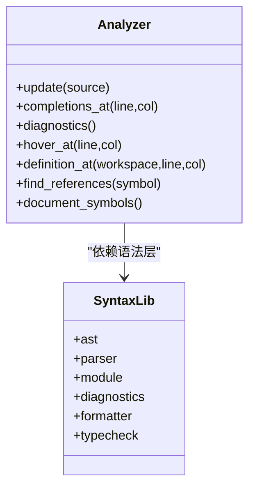
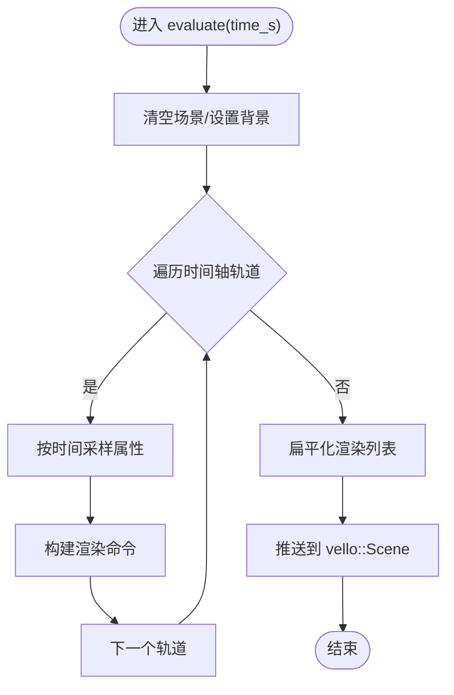
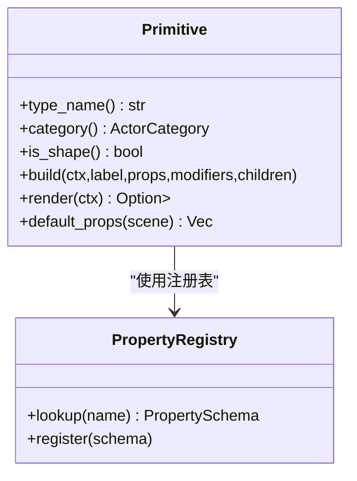
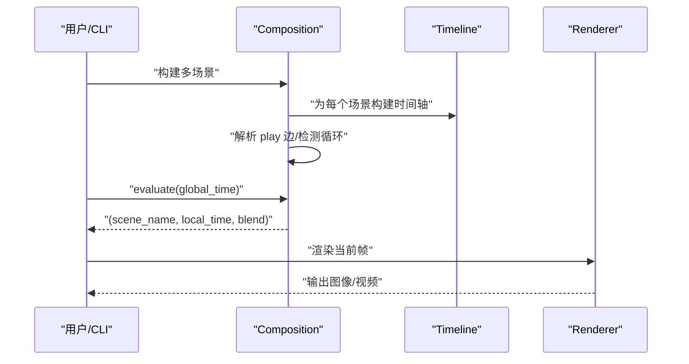
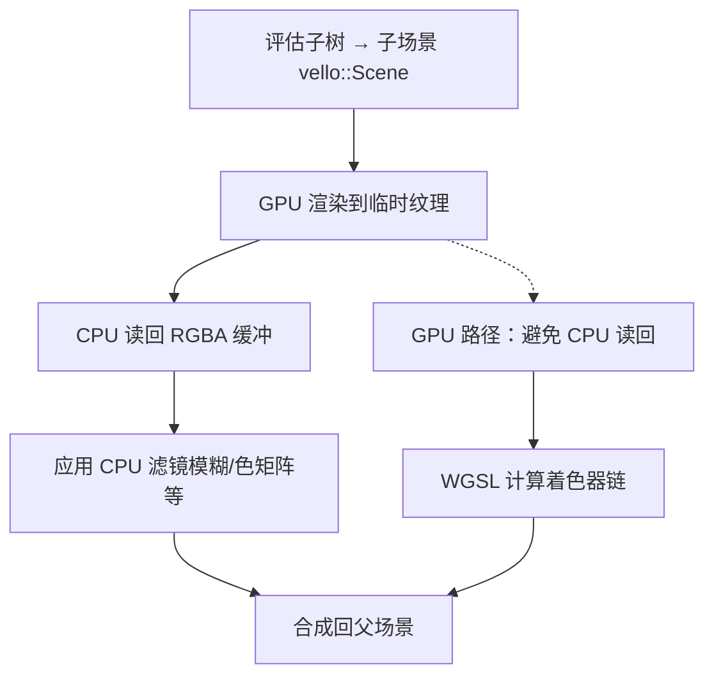
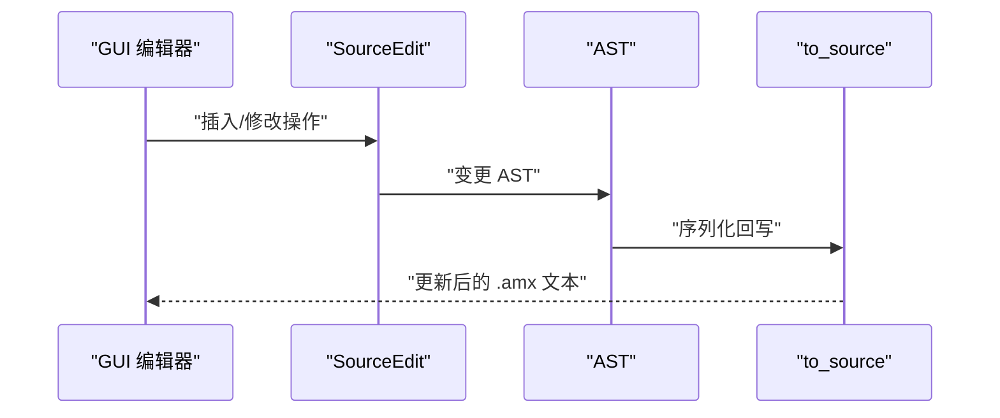
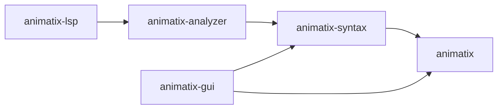

# 项目概述

<cite>
**本文档引用的文件**
- [Readme.md](file://Readme.md)
- [Cargo.toml](file://Cargo.toml)
- [PLAN.md](file://PLAN.md)
- [docs/roadmap.md](file://docs/roadmap.md)
- [docs/architecture.md](file://docs/architecture.md)
- [docs/spec.md](file://docs/spec.md)
- [crates/animatix/src/lib.rs](file://crates/animatix/src/lib.rs)
- [crates/animatix-gui/src/lib.rs](file://crates/animatix-gui/src/lib.rs)
- [crates/animatix-analyzer/src/lib.rs](file://crates/animatix-analyzer/src/lib.rs)
- [crates/animatix-syntax/src/lib.rs](file://crates/animatix-syntax/src/lib.rs)
- [examples/README.md](file://examples/README.md)
- [examples/16_showcase.amx](file://examples/16_showcase.amx)
</cite>

## 目录
1. [引言](#引言)
2. [项目结构](#项目结构)
3. [核心组件](#核心组件)
4. [架构总览](#架构总览)
5. [详细组件分析](#详细组件分析)
6. [依赖关系分析](#依赖关系分析)
7. [性能考量](#性能考量)
8. [故障排除指南](#故障排除指南)
9. [结论](#结论)
10. [附录](#附录)

## 引言
Animatix 是一个基于 Rust 的声明式动画系统，专注于用可编辑的领域特定语言（DSL）构建解释性数学、图表与矢量动画。它提供从源码到渲染的完整流水线：解析器（Chumsky + Tree-sitter）、时间轴编译、合成（多场景过渡）、以及渲染后端（Vello/WGPU）。项目同时包含桌面 GUI 编辑器、语言智能（Analyzer/LSP）、以及丰富的示例与教程，适合教学演示、可视化创作与工程化导出。

目标用户与场景
- 教育与科普：制作数学公式推导、物理过程演示、数据可视化等解释性动画
- 设计与演示：快速搭建产品介绍、交互说明、动态图表
- 工程与自动化：批量导出视频/GIF、与 CI 集成、参数化生成

与其他工具的区别
- 声明式 DSL：以“属性-时间-动作”为核心，强调可编辑的时间线与可复现的导出
- 多场景合成：原生支持跨场景播放与过渡，自动路由与诊断
- 统一渲染管线：底层统一在 Vello/WGPU 上实现，CLI/GUI/导出一致性高
- 模块化语言层：语法层与运行时分离，Analyzer 独立于渲染栈，便于 LSP/IDE 集成

## 项目结构
Animatix 采用多 crate 工作区组织，围绕“语法层 → 运行时 → 工具链”的分层设计：

- crates/animatix-syntax：语法与 AST、模块系统、诊断、格式化、类型检查
- crates/animatix：运行时引擎（时间轴、合成、渲染、原语）
- crates/animatix-analyzer：语言智能（补全、悬停、跳转、符号、诊断）
- crates/animatix-gui：桌面 GUI（egui/eframe），支持预览、插入、重排、导出
- crates/animatix-lsp：LSP 服务（tower-lsp JSON-RPC）
- crates/tree-sitter-animatix：Tree-sitter 语法树，用于编辑器高亮与增量解析

**图表来源**
- [Cargo.toml:1-11](file://Cargo.toml#L1-L11)
- [crates/animatix/src/lib.rs:1-24](file://crates/animatix/src/lib.rs#L1-L24)
- [crates/animatix-analyzer/src/lib.rs:1-800](file://crates/animatix-analyzer/src/lib.rs#L1-L800)
- [crates/animatix-gui/src/lib.rs:1-18](file://crates/animatix-gui/src/lib.rs#L1-L18)
- [crates/animatix-syntax/src/lib.rs:1-29](file://crates/animatix-syntax/src/lib.rs#L1-L29)

**章节来源**
- [Cargo.toml:1-11](file://Cargo.toml#L1-L11)
- [docs/architecture.md:682-757](file://docs/architecture.md#L682-L757)

## 核心组件
- 解析与 AST：Chumsky 构建语义 AST；Tree-sitter 提供位置查询与增量解析；to_source 支持回写
- 时间轴与动画：键帧、缓动、属性轨道、路径插值、重声明触发形态变化
- 合成与多场景：场景声明、play 边、时间映射、过渡混合、自动路由
- 渲染后端：Vello/WGPU 管线，支持 PNG/PPM 单帧与视频/GIF 导出；滤镜容器支持 CPU/GPU 后处理
- 原语系统：统一的 Primitive trait，注册表驱动的属性系统，布局容器与变换
- 语言智能：Analyzer 提供补全、悬停、跳转、符号、诊断；LSP 服务
- GUI：预览、插入面板、拖拽重排、源码回写、历史与快照管理

**章节来源**
- [docs/architecture.md:14-53](file://docs/architecture.md#L14-L53)
- [docs/architecture.md:56-111](file://docs/architecture.md#L56-L111)
- [docs/architecture.md:183-256](file://docs/architecture.md#L183-L256)
- [docs/architecture.md:608-658](file://docs/architecture.md#L608-L658)
- [docs/architecture.md:682-757](file://docs/architecture.md#L682-L757)

## 架构总览
Animatix 的核心是“文件处理流水线 + 运行时评估 + 渲染输出”。语法层负责将 .amx 源码转换为 AST，并通过 Analyzer 提供语言智能；运行时将 AST 编译为时间轴，支持单场景与多场景合成；渲染阶段统一在 Vello/WGPU 上执行，支持多种导出格式。

**图表来源**
- [docs/architecture.md:14-53](file://docs/architecture.md#L14-L53)
- [crates/animatix/src/lib.rs:12-24](file://crates/animatix/src/lib.rs#L12-L24)
- [crates/animatix-analyzer/src/lib.rs:40-134](file://crates/animatix-analyzer/src/lib.rs#L40-L134)

**章节来源**
- [docs/architecture.md:3-53](file://docs/architecture.md#L3-L53)

## 详细组件分析

### 语法与类型系统
- AST 与模块：AST 层提供语义节点与模块发现/展开；to_source 支持稳定回写；共享遍历层减少重复
- 类型检查：渐进式类型系统，校验组件实例化与动作调用参数；诊断通过 Analyzer/LSP 暴露
- 格式化与增量：format_core 与 to_source 规范化格式；Tree-sitter 用于位置查询与增量更新

**图表来源**
- [crates/animatix-analyzer/src/lib.rs:40-442](file://crates/animatix-analyzer/src/lib.rs#L40-L442)
- [crates/animatix-syntax/src/lib.rs:1-29](file://crates/animatix-syntax/src/lib.rs#L1-L29)

**章节来源**
- [crates/animatix-analyzer/src/lib.rs:1-800](file://crates/animatix-analyzer/src/lib.rs#L1-L800)
- [crates/animatix-syntax/src/lib.rs:1-29](file://crates/animatix-syntax/src/lib.rs#L1-L29)

### 时间轴与动画系统
- 数据结构：Timeline 包含轨道、节点、修饰语；AnimationTrack 分层存储几何/样式/载荷
- 采样逻辑：PropertyTrack 在时间点上插值，支持缓动曲线
- 形态插值：重声明触发路径/文本插值，分层级对齐与插值策略

**图表来源**
- [docs/architecture.md:89-111](file://docs/architecture.md#L89-L111)

**章节来源**
- [docs/architecture.md:56-111](file://docs/architecture.md#L56-L111)

### 原语与属性系统
- Primitive trait：新增原语只需实现三处触点，注册表驱动分发
- 属性注册表：统一 schema 描述，读写分离，注入环境支持 reactive
- 布局系统：父驱动布局 + 显式手动放置兜底；动态布局与拖拽重排

**图表来源**
- [docs/architecture.md:608-658](file://docs/architecture.md#L608-L658)

**章节来源**
- [docs/architecture.md:419-478](file://docs/architecture.md#L419-L478)
- [docs/architecture.md:608-658](file://docs/architecture.md#L608-L658)

### 多场景合成与过渡
- 场景声明与 play 边：自动构建 per-scene 时间轴，解析 play 边并检测循环
- 时间映射：全局时间映射到场景局部时间与过渡混合系数
- 导出路由：BuildTarget 自动区分单/多场景并调度

**图表来源**
- [docs/architecture.md:42-52](file://docs/architecture.md#L42-L52)
- [docs/architecture.md:660-680](file://docs/architecture.md#L660-L680)

**章节来源**
- [docs/architecture.md:42-52](file://docs/architecture.md#L42-L52)
- [docs/architecture.md:660-680](file://docs/architecture.md#L660-L680)

### 渲染与导出
- Vello 管线：命令驱动渲染，统一到 vello::Scene
- 导出：PNG/PPM 单帧；视频/GIF 并行渲染 + FFmpeg 混流
- 滤镜容器：Filter 作为容器原语，先子树渲染到离屏纹理，再应用后处理，最后合成回父场景

**图表来源**
- [docs/architecture.md:224-256](file://docs/architecture.md#L224-L256)
- [docs/architecture.md:268-366](file://docs/architecture.md#L268-L366)

**章节来源**
- [docs/architecture.md:183-256](file://docs/architecture.md#L183-L256)
- [docs/architecture.md:268-366](file://docs/architecture.md#L268-L366)

### GUI 与源码回写
- AST 变更 + 重新序列化：GUI 修改 AST 并通过 to_source 写回，保持格式规范化
- 插入机制：统一 SourceEdit → AST 变更 → 重新序列化，保证时间线安全与上下文感知

**图表来源**
- [docs/architecture.md:505-562](file://docs/architecture.md#L505-L562)

**章节来源**
- [docs/architecture.md:505-562](file://docs/architecture.md#L505-L562)

## 依赖关系分析
- 依赖拆分：animatix-syntax 仅依赖 chumsky/tracing；animatix-analyzer 仅依赖 animatix-syntax，不引入图形/渲染依赖
- 运行时依赖：animatix 依赖语法层与运行时依赖（WGPU/Vello 等），GUI 依赖 animatix 与 animatix-syntax
- LSP 依赖：animatix-lsp 依赖 animatix-analyzer 与 tower-lsp

**图表来源**
- [Cargo.toml:1-11](file://Cargo.toml#L1-L11)
- [docs/architecture.md:733-754](file://docs/architecture.md#L733-L754)

**章节来源**
- [Cargo.toml:1-11](file://Cargo.toml#L1-L11)
- [docs/architecture.md:733-754](file://docs/architecture.md#L733-L754)

## 性能考量
- 渲染路径：滤镜容器当前采用 CPU 读回 + 图像处理，存在读回瓶颈；计划通过 WGSL 计算着色器链与零读回合成提升性能
- 并行导出：并行渲染帧显著降低总时长，适合批量导出
- 动态布局：启用 dynamic_layout 时每帧重新采样布局尺寸，注意性能权衡
- 表达式与绘图：PlotCurve 使用自适应细分采样，复杂函数与高分辨率需谨慎

[本节为通用指导，无需具体文件分析]

## 故障排除指南
- 语法错误与诊断：Analyzer 将解析错误与类型诊断暴露给 GUI/LSP；优先查看诊断消息与定位
- 多场景问题：play 循环、目标缺失、多重 play 目标、孤立场景等均有明确诊断
- 滤镜性能：大量嵌套滤镜或大分辨率会增加内存与时间开销；考虑 GPU 路径或减少嵌套
- 源码回写：若出现格式异常，确认 to_source 是否正确回写；必要时检查 AST 变更是否符合规则

**章节来源**
- [crates/animatix-analyzer/src/lib.rs:377-425](file://crates/animatix-analyzer/src/lib.rs#L377-L425)
- [docs/architecture.md:670-678](file://docs/architecture.md#L670-L678)

## 结论
Animatix 以声明式 DSL 与统一渲染管线为核心，结合模块化语言层与强大的 GUI/Analyzer 生态，形成从创作到导出的一体化方案。其多场景合成、路径插值、滤镜后处理与可扩展原语系统，使其在教育、演示与工程化导出场景中具备良好适用性。未来将持续优化滤镜 GPU 路径、完善语言表面与工具链体验。

[本节为总结性内容，无需具体文件分析]

## 附录

### 快速开始与示例
- 示例清单与场景：见 examples/README.md 与 examples/*.amx
- 官方示例：showcase、layout、plotting、math、line/ellipse、image、reveal/motion、composition、morph、code、components、reactive、multi-scene 等
- CLI 导出：render、image、video、gif 等命令

**章节来源**
- [Readme.md:114-178](file://Readme.md#L114-L178)
- [examples/README.md](file://examples/README.md)

### 语言规范与状态矩阵
- 语言状态矩阵：列出已实现/部分实现/计划的功能面，帮助理解当前能力边界
- 关键语法：声明、键帧、颜色系统、动作与修饰符、容器与布局、原语类型、反应式系统、导入/模块/命名空间、组件等

**章节来源**
- [docs/spec.md:22-63](file://docs/spec.md#L22-L63)
- [docs/spec.md:90-196](file://docs/spec.md#L90-L196)
- [docs/spec.md:219-375](file://docs/spec.md#L219-L375)
- [docs/spec.md:438-581](file://docs/spec.md#L438-L581)
- [docs/spec.md:584-714](file://docs/spec.md#L584-L714)
- [docs/spec.md:716-758](file://docs/spec.md#L716-L758)
- [docs/spec.md:760-800](file://docs/spec.md#L760-L800)

### 发展历程与路线图
- 当前重点：保持语言表面一致性、扩展已有运行时契约、改善 GUI/编辑器体验
- 路线图：维护性改进、架构评估、GUI AST 重复消除、格式边界、循环展开等已完成；冰山项如画中画、无损空白保留等待进一步设计

**章节来源**
- [Readme.md:173-178](file://Readme.md#L173-L178)
- [docs/roadmap.md:1-44](file://docs/roadmap.md#L1-L44)

### 语法迁移计划（列表 vs 元组）
- 目标：清理兼容性，明确 (…) 为固定大小元组/向量，{…} 为变长列表
- 分阶段：AST 基础、解析与 Tree-sitter、格式化与回写、类型与属性、运行时求值、领域消费者、示例/文档/测试
- 风险与缓解：解析歧义、单元素集合、空字面量、运行时回退、属性注册表同步

**章节来源**
- [PLAN.md:1-60](file://PLAN.md#L1-L60)