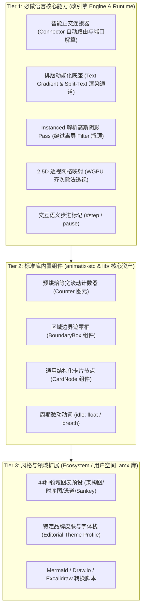
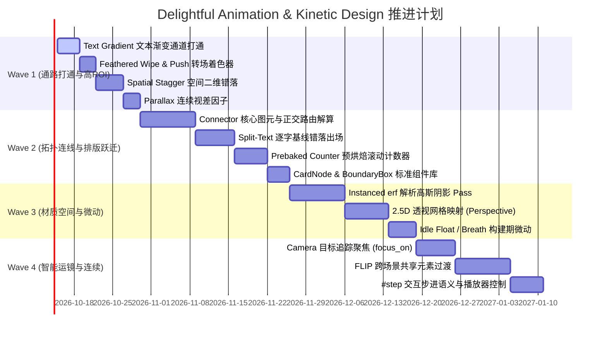

# Delightful Animation & Kinetic Design Plan (赏心悦目动效与动能排版架构规划)

> **状态**：设计提案与技术实施方案（2026-10-10）。
> **目标**：突破当前 Animatix 语言的“机械感 / AI味”，融合编辑级设计系统（如 `diagram-design` 规范），建立涵盖**动能排版**、**智能连接与端口**、**连续物理**、**材质光影**、**2.5D深度**、**智能运镜**与**无缝转场**的高级动效体系。
> **关联文档**：[`docs/spec.md`](spec.md), [`docs/architecture.md`](architecture.md), [`docs/roadmap.md`](roadmap.md), [`docs/primitive_abstraction.md`](primitive_abstraction.md), [`docs/ai_agent_animation_quality.md`](ai_agent_animation_quality.md)。

---

## 1. 现状审查与痛点诊断 (Audit Findings)

通过对现有代码库（`animatix-core`, `animatix-std`, `animatix-syntax`, `animatix-text`, `animatix`, `animatix-render`）及代表性案例（[`web/scenes/hero.amx`](../web/scenes/hero.amx), [`examples/gallery/motion_poster.amx`](../examples/gallery/motion_poster.amx), [`examples/animation/35_camera_moves.amx`](../examples/animation/35_camera_moves.amx)）的深度审查，当前动效与图表能力存在以下核心瓶颈：

| # | 痛点表现 | 根本原因与代码证据 | 视觉与维护缺陷 |
|---|---------|-------------------|-------------|
| **P1** | **排版表现力僵硬** | 1. `draw-in` 仅在 `dispatch.rs:514` 做粗暴的 `paths.truncate(n)` 数组截断；<br>2. 缺乏 Split-Text 原语，`motion_poster.amx` 被迫将单个单词拆成 6 个 `Text` 塞进 `Row`，**彻底摧毁了字距微调（Kerning）和合字**；<br>3. `fill_gradient` 在 `property.rs:349` 限制为 `AllShapesExceptLine`，文本无法使用渐变；<br>4. 计数器在 `always` 里每帧格式化，每帧击穿 `lock_compile_cache()` 导致全量字体解析。 | 标题文字毫无弹性与呼吸感，无法实现现代 SaaS / Apple 级的字符升起裁切与流光文字。 |
| **P2** | **缺乏智能连线与端口吸附** | 只有两点直线的 `Line` / `Arrow`。画正交圆角折线必须手写 `Path, commands: {move_to, line_to, quad_to...}`，**所有拐点和箭头坐标全靠作者草稿纸手算**；且节点移动后连线不会跟随。 | 绘制架构图、流程图极度痛苦，节点位置微调导致所有连线瞬间错位报废。 |
| **P3** | **物理断层与速度冲击** | 1. 新动作打断旧动作时（`actions/motion.rs:259`），仅采样位置点插入新缓动帧，**初速度强行归零或突变**（$C^0$ 连续但 $C^1$ 断裂）；<br>2. `Easing::Spring` (`easing.rs:159`) 初速度被写死为阻尼系数，无法传导惯性；<br>3. 缺乏跟随机制，`hero.amx` 中下划线与滑块必须手动硬编码相同时间/缓动/像素。 | 动作切换生硬机械，缺乏真实物体的惯性传递与次级运动（Secondary Motion）。 |
| **P4** | **材质与光影开销沉重** | 1. 卡片投影必须嵌套 `Filter` 作用域；每个 `Filter` 触发一次独立离屏 Vello 光栅化 + 3 次贴图拷贝 + 16-Tap 泊松圆盘 Compute 采样 + 1 次 Blit（`filter_backend.rs`），**完全无法 GPU 合并批处理**；<br>2. 场景树受限于 `kurbo::Affine` 纯 2D 仿射变换，无 2.5D 深度。 | 卡片缺乏层次悬浮感；少量卡片阴影即可导致 GPU 显存带宽击穿、帧率跌破 60fps。 |
| **P5** | **运镜脆弱与空间扁平** | 1. 镜头（`camera.rs`）缺乏声明式聚焦，`35_camera_moves.amx` 必须手动计算像素比例（`400 * 1.7 = 680`）；<br>2. `camera_follow` 是纯布尔值，缺乏连续视差系数。 | 运镜极难维护，画面缺少前景/中景/背景的纵深视差。 |
| **P6** | **转场硬边切割与场景割裂** | 1. `transition.rs:89` 的 Wipe 转场使用硬编码 `step()`，边缘呈现 1 像素锯齿硬切；<br>2. 跨场景切换时缺乏共享元素过渡（FLIP），页面元素无法跨场地位移。 | 场景切换具有强烈“PPT翻页感”，无法做到现代 UI 的流体无缝衔接。 |
| **P7** | **静止期死寂感与缺步进** | 1. 为图元添加持续微动必须在 `always` 中编写复杂的正弦波与 `fbm` 表达式；<br>2. 时间轴缺乏离散的交互式步进（`#step`）暂停标记。 | 元素静止时缺乏生命力；无法支持类似 `diagram-design` 的教学分步演示。 |

---

## 2. 核心工程铁律 (Engineering Invariants)

在进行设计与扩展时，必须严格遵守 Animatix 架构的以下铁律：

1. **无状态随机访问 (Stateless Random Access & Scrubbing)**：
   Animatix 的核心特性是多线程并发导出（单帧完全独立渲染）与时间轴任意点 Scrubbing。**严禁引入跨帧状态累积的隐式数值积分**（如基于上一帧速度累加的欧拉/Verlet 模拟）。一切物理与微动必须具备解析闭式解（Closed-form solution）或在构建期（Timeline Build）静态烘焙为关键帧。
2. **热路径零分配 (Zero-Alloc Hot Path)**：
   每帧求值（`evaluate_node`）严禁发生动态内存分配或昂贵的字符串解析。能在 Build 阶段解算的数据（如空间错落排序、文字预烘焙、引导轨道综合、后置连接线路由），绝不推迟到每帧执行。
3. **单一真相源与 ABI 稳定 (Single Source of Truth)**：
   新增属性必须按顺序追加至 `animatix-core::property::PROPERTY_DESCRIPTORS`，并同步更新 `raw_property_types` 与 `property_registry::BINDINGS`，绝不允许打破 Descriptor 索引。

---

## 3. 系统分层与组件抽象化设计 (System Layering & Component Abstraction)

借鉴 `cathrynlavery/diagram-design` 等前沿设计系统的优点，并结合 Animatix 现有的组件模型（[`spec.md §12 Components`](spec.md#L1611)），我们将这套方案严格划分为三个层次，避免核心引擎膨胀：



### 分层设计原则与边界判定：
1. **Tier 1 (Core Engine / Runtime)**：
   凡是**纯组件或脚本无法实现的能力**（如跨节点几何路由、着色器 Pass、编译器语法扩充、Vello 图层遮罩调用），必须由引擎承载。
2. **Tier 2 (Standard Library / `animatix-std` & `lib/ui.amx`)**：
   通用、高频、无偏见的基础图元与组件，服务所有类型的动效（无论是图表、广告、UI 演示）。
3. **Tier 3 (Ecosystem / Domain Extensions)**：
   特定业务场景（如 44 种领域图表模板）、特定品牌颜色（如焦橙 `#bf4520`）和外部格式导入器，**严禁硬编码进核心引擎**，统一作为独立的 `.amx` 扩展包维护。

---

## 4. 详细技术方案：六大能力全景落地

### 方案一：智能连接与图表拓扑 (Connectors & Diagram Topology)

#### 1.1 智能正交连接器 (`Connector` 核心图元) [Tier 1]
*   **可行性**：**高（基于 Post-Layout Routing Pass 实现）**。
*   **引擎底层改动**：
    1. 在 `animatix-core` 注册 `Connector` 图元，接收 `from: ActorRef`, `to: ActorRef`, `routing: "elbow" | "l-bend" | "straight"`, `radius: Num`, `label: Str`。
    2. **后置几何路由传递 (Post-Layout Routing Pass)**：
       在 Taffy 布局完成之后、时间轴最终固化之前，执行一次路由解算：
       - 采样源与目标节点的世界 AABB 边界。
       - 根据目标节点所处的方位象限（或声明的 `.north/.south/.east/.west` 端口），计算垂直出入边界点 $(x_1, y_1)$ 与 $(x_2, y_2)$。
       - 生成带 $r=8$ 圆角的正交折线 Bezier 路径：
         $$\text{mid}_x = \frac{x_1 + x_2}{2}, \quad (x_1, y_1) \to (\text{mid}_x - r, y_1) \xrightarrow{\text{Quad}} (\text{mid}_x, y_1 + r) \to (\text{mid}_x, y_2 - r) \xrightarrow{\text{Quad}} (\text{mid}_x + r, y_2) \to (x_2, y_2)$$
       - 自动在垂直线段正中挂载带背景色遮罩的连线标签。
*   **收益**：节点由于内容变化或布局伸缩移动时，连线在构建期自动重新路由，彻底告别手算绝对坐标。

#### 1.2 区域边界遮罩框 (`BoundaryBox` 组件) [Tier 2]
*   **定位**：`lib/ui.amx` 标准组件。
*   **实现**：基于 `Stack` + `Rect(dashed)` + 顶部带背景色小矩形遮罩的 `Text` 组合，为区域/VPC/模块提供标准的分组边界。

#### 1.3 结构化卡片节点 (`CardNode` 组件) [Tier 2]
*   **定位**：`lib/ui.amx` 标准组件。
*   **实现**：内置标准排版层级（Eyebrow + Title + Sublabel + Status Dot + Focal 强调色标记），消除画单个节点需手工嵌套 5 层容器的冗长代码。

---

### 方案二：动能排版与文字表现力 (Kinetic Typography)

#### 2.1 文本渐变填充 (Text Gradient) [Tier 1]
*   **可行性**：**极高 / 低风险**（改动量 $\approx 80$ 行代码）。
*   **Vello 原生支持**：Vello 的 `scene.fill(..., brush, ..., &text_path.path)` 原生支持对任意 `kurbo::BezPath`（包括文字轮廓）传入 `peniko::Gradient`。
*   **落地实现**：
    1. 在 [`crates/animatix-core/src/property.rs`](property.rs) 将 `fill_gradient`、`gradient_extend`、`gradient_space` 扩展为 `Applicable::Any(&[Applicable::AllShapesExceptLine, Applicable::TextLike])`。
    2. 在 [`declarations_text.rs`](declarations_text.rs) 接收文本渐变声明并存入 `track.style.fill_gradient`。
    3. 扩充 `RenderCommand::Text`，以文本包围盒为基准映射渐变 Brush 传给 Vello。

#### 2.2 Split-Text（逐字/逐词/逐行错落基线展开）[Tier 1]
*   **可行性**：**高（推荐“程序化字形错落求值”方案）**。
*   **落地实现**：
    1. **元数据轻量下沉**（`crates/animatix-text/src/lib.rs`）：
       在 `TextPath` 中增加轻量排版索引与几何中心（Fast Path 已经具备 `LineInfo` / `WordInfo`）：
       ```rust
       pub struct TextPath {
           pub path: BezPath,
           pub color: [u8; 4],
           pub opacity: f32,
           pub line_idx: u16,
           pub word_idx: u16,
           pub char_idx: u16,
           pub glyph_center: [f32; 2],
       }
       ```
    2. **时间轴单轨进度**（`crates/animatix/src/timeline/actions/reveal.rs`）：
       扩展动作修饰符：`draw-in [by: word, stagger: 40ms, offset_y: 24, mask: baseline]`。
    3. **帧求值仿射映射**（`crates/animatix/src/primitives/text.rs`）：
       求值阶段遍历各字形，字形序号 $k$ 根据全局进度 $P$ 计算局部归一化时间 $t_k = \text{clamp}\left(\frac{P - k \cdot \text{stagger}}{1 - (K-1)\cdot \text{stagger}}, 0, 1\right)$。
       计算局部位移 $\Delta y_k$ 与透明度 $\text{opacity}_k$。
    4. **基线遮罩 (Baseline Mask)**：
       利用 Vello 原生的 `scene.push_layer(..., &line_clip_rect)`，字形从行基线下方升起时自动被遮罩裁切，**单帧开销 $< 0.02\text{ms}$**。

#### 2.3 预烘焙数值滚动计数器 (Rolling Counter / Odometer) [Tier 2]
*   **可行性**：**高（构建期字形预烘焙 + Vello 图层槽位裁切）**。
*   **落地实现**：
    1. 新增 `Counter` 图元：在构建期**仅调用一次字体引擎**，提取 `0123456789,.-` 的贝塞尔曲线，统一列宽为等宽数字宽度 `col_width = max(advance(0..=9))`，彻底解决比例字体横向抖动。
    2. 渲染阶段：为每个数位列执行 `scene.push_layer(..., &slot_rect)` 视口裁切，仅绘制当前数字与下一数字。
    3. **性能收益**：**单帧耗时 $< 0.005\text{ms}$，杜绝 `always` 重排造成的 100% 缓存击穿与掉帧**。

---

### 方案三：连续物理、编排与次级运动 (Continuous Physics & Choreography)

#### 3.1 连续初速度与弹簧接续 (Spring Handoff with Initial Velocity) [Tier 1]
*   **可行性**：**中高（解析导数 + 投影标量初速度）**。
*   **落地实现**：
    1. 为所有缓动函数提供闭式导数 `easing_derivative(progress, easing) -> f32`。打断时刻 $t_0$ 采样前序动作末速度 $\vec{v}_0$。
    2. 将初速度矢量 $\vec{v}_0$ 投影到新动作的位移方向向量 $\vec{u} = \frac{\Delta \vec{X}}{\|\Delta \vec{X}\|}$ 上，折算为主方向的归一化标量初速度 $v_{0,\text{proj}} = \vec{v}_0 \cdot \vec{u}$。
    3. 扩充 `Easing::SpringV0 { damping, frequency, v0_norm }` 解析初值解。
    4. 插入新帧时，调用 `keyframes.split_off(&t_start)` 剔除覆盖区间的残留旧关键帧。

#### 3.2 空间二维级联错落 (Spatial / Radial Stagger) [Tier 1]
*   **可行性**：**极高 / 阻力最小**。
*   **落地实现**：
    1. 扩展语法：`stagger [each: 40ms, from: center | top-left | (x, y), metric: euclidean | manhattan]`。
    2. 在 Timeline 构建期，直接读取子图元在容器内计算好的 2D 物理坐标。
    3. 计算各子图元空间距离 $D_i$，按距离聚类分环（波前），同一环上的元素分配相同的起跳时间戳，实现水波扩散展开。

#### 3.3 约束与跟随机制 (Lead-Follow via Build-time Track Synthesis) [Tier 1]
*   **可行性**：**中（坚守构建期综合生成，拒绝运行时状态累积）**。
*   **落地实现**：
    引入 `follow carriage.at [target: underline.draw_tip, lag: 60ms, spring: (6, 9)]`。在构建期采样领头图元解析曲线并施加时间延迟与阻尼卷积，**直接为跟随者综合生成一条独立的 `PropertyTrack`**，运行时零开销。

---

### 方案四：材质光影、2.5D深度与场景转场 (Materials & 2.5D)

#### 4.1 卡片原生解析高斯阴影 (Instanced erf Gaussian Shadow Pass) [Tier 1]
*   **可行性**：**高（用解析闭式解取代 Compute 采样滤镜）**。
*   **落地实现**：
    1. 利用圆角矩形高斯模糊卷积的解析误差函数闭式解（Evan Wallace / IQ erf approximation）：
       $$I(x, y) = \frac{1}{4} \left[ \text{erf}\left(\frac{x - x_0}{\sqrt{2}\sigma}\right) - \text{erf}\left(\frac{x - x_1}{\sqrt{2}\sigma}\right) \right] \cdot \left[ \text{erf}\left(\frac{y - y_0}{\sqrt{2}\sigma}\right) - \text{erf}\left(\frac{y - y_1}{\sqrt{2}\sigma}\right) \right]$$
       片元着色器只需纯 ALU 指令算出精确透光率，**0 次纹理采样**。
    2. 新增 `InstancedShadowPipeline`，每个带阴影的卡片只提交 40 字节 Instance 数据。在主 Vello 场景前，**单次 Draw Call 绘制全屏所有卡片的高斯阴影**。

#### 4.2 2.5D 透视变换与倾斜 (Perspective & 3D Tilt) [Tier 1]
*   **可行性**：**中（局部离屏 + GPU 硬件齐次除法透视网格）**。
*   **落地实现**：
    1. 声明 `rotate_x: deg(15)`, `rotate_y: deg(-20)`, `perspective: 800`。
    2. 节点局部光栅化至离屏纹理后，通过 `PerspectiveBlitPipeline` 绘制带有 $4\times 4$ MVP 矩阵的双三角形 Quad。
    3. 利用 GPU 硬件光栅化器原生的 $\frac{uv}{w}$ 齐次透视除法完成数学上完美的透视缩放与梯形贴图映射。

#### 4.3 柔和羽化与推挤转场 (Feathered Wipe & Push Transitions) [Tier 1]
*   **可行性**：**极高 / 即刻落地**（改动量 $\approx 50$ 行代码）。
*   **落地实现**：在 `TRANSITION_SHADER_WGSL` 中将 `step` 替换为 `smoothstep` 实现羽化；并通过反向 UV 偏移实现推挤转场。

#### 4.4 跨场景共享元素过渡 (FLIP Transition) [Tier 1]
*   **可行性**：**中高（世界状态采样 + 元素抑制 + 顶层浮动覆绘）**。
*   **落地实现**：
    1. 通用标记 `shared_id: "card_a"`。
    2. 转场重叠期提取共享 Actor 在两场景的世界矩阵 $M_A, M_B$ 与尺寸。
    3. **元素抑制 (Suppression Mask)**：渲染底层两个场景贴图时，临时将带有该 `shared_id` 的 Actor 标记为 `opacity = 0`，杜绝重影。
    4. **浮动层覆绘 (Floating Overlay Pass)**：在顶层单独立覆盖层 Vello Scene 插值绘制该图元。

---

### 方案五：智能运镜、视差与环境微动 (Camera, Parallax & Ambient Life)

#### 5.1 目标追踪运镜与视差分层 (Target-Tracking Camera & Parallax) [Tier 1]
*   **连续视差因子 (Parallax)**：将 `camera_follow: bool` 升级为连续浮点数 `parallax: f32`（默认 1.0），根节点变换设为 `lerp(Affine::IDENTITY, camera_affine, parallax)`。
*   **目标聚焦 (`camera.focus_on(card, padding: 40)`)**：构建期查询目标包围盒，自动反解并为 `camera.pan` 和 `camera.zoom` 合成关键帧。

#### 5.2 声明式环境微动 (`idle: float / breath`) [Tier 2]
*   **实现**：构建期在 `motion_offset` 和 `scale` 轨道上自动铺设采样好的无缝闭合正弦关键帧，运行时零解释器开销。

#### 5.3 交互语义步进标记 (`#step` 与暂停控制) [Tier 1]
*   **实现**：支持 `#step 1` 语法，时间轴记录 `pause_points: Vec<u64>`，驱动 Web/GUI 播放器的单步步进教学交互。

---

## 5. 开发体验对比：升级前后的实战代码 (DX Showcase)

以绘制一个包含前后端服务节点及一条带圆角折线箭头的架构图动效为例：

### 现状（手算坐标、极其繁琐脆弱）：
```animatix
// 现存写法：痛苦的绝对坐标计算与硬编码
boxA: Rect, size: (180, 80), at: (200, 300), corner_radius: 8, color: surface.primary
titleA: Text, text: "Frontend", at: (200, 300)

boxB: Rect, size: (180, 80), at: (600, 480), corner_radius: 8, color: surface.primary
titleB: Text, text: "Backend API", at: (600, 480)

// 手算 6 个路径点，一旦 boxA 或 boxB 移动，全部报废
conn: Path, commands: {
  move_to(290, 300), line_to(392, 300),
  quad_to(400, 300, 400, 308), line_to(400, 472),
  quad_to(400, 480, 408, 480), line_to(510, 480)
}, stroke: stroke.default, stroke_width: 1.5
arrow_tip: Polygon, points: {(0, -4), (8, 0), (0, 4)}, at: (510, 480)
lbl: Text, text: "HTTPS", font_size: 10, at: (400, 390)
```

### 升级后（语义清晰、自适应排版、高阶动能）：
```animatix
import "lib/ui.amx" // 导入标准 CardNode

client: CardNode, title: "Frontend", eyebrow: "CLIENT", at: (200, 300)
server: CardNode, title: "Backend API", eyebrow: "INGRESS", sub: "port 443", at: (600, 480), focal: true

// 核心 Connector 图元：自动计算两折正交拐弯、自动放置标签、自动避让
req: Connector,
  from: client.east,
  to: server.west,
  routing: "elbow",
  radius: 8,
  label: "HTTPS 443"

#step 1
stagger [100ms] {
  settle-in client [400ms]
  settle-in server [400ms]
}

#step 2
draw-in req [600ms]
```

---

## 6. 四阶段实施路线图 (Phased Implementation Roadmap)



### 交付清单与验收标准：
1. **Wave 1 (1~2周)**：`Text Gradient` + `Feathered Wipe / Push` + `Spatial Stagger` + `Parallax`。验收：更新官网 Banner 及转场 Demo。
2. **Wave 2 (3~4周)**：`Connector` 正交路由 + `Split-Text` 基线展开 + `Counter` 计数器 + `CardNode`/`BoundaryBox`。验收：重写 `motion_poster.amx` 与架构图 Demo，彻底告别手算坐标。
3. **Wave 3 (3~4周)**：`Instanced erf Shadow` 原生阴影 + `2.5D Perspective` 倾斜 + `idle: float/breath` 微动。验收：20 张带阴影倾斜卡片帧耗时 $\le 12\text{ms}$。
4. **Wave 4 (3~4周)**：`Camera Focus` 运镜 + `FLIP Transition` 共享元素 + `#step` 步进暂停。验收：支持从列表到详情页的无缝跨场景转场与分步演示。
