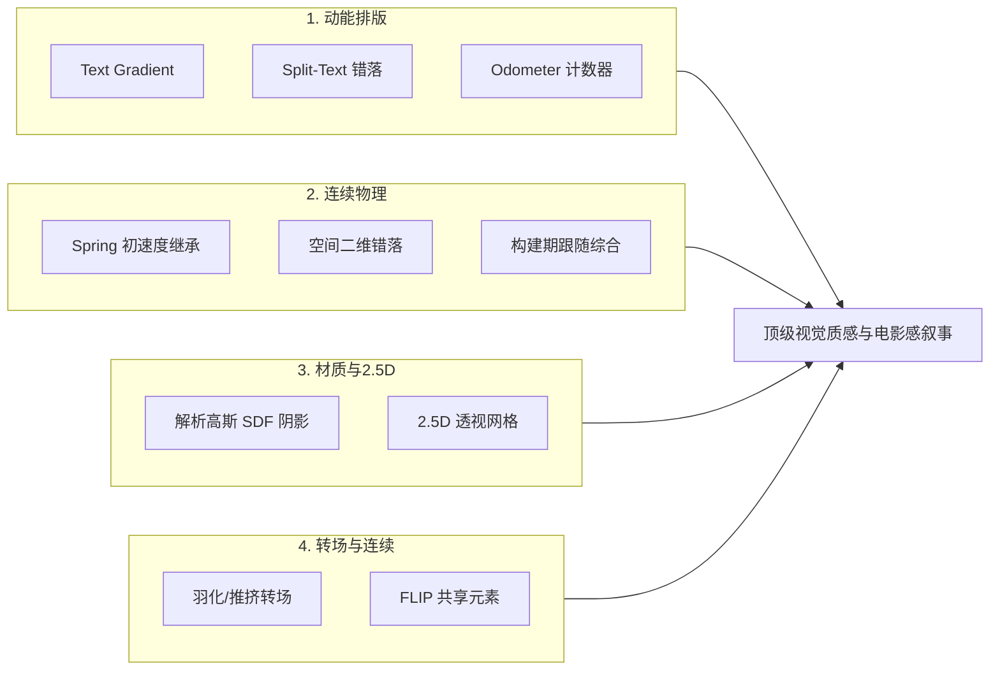
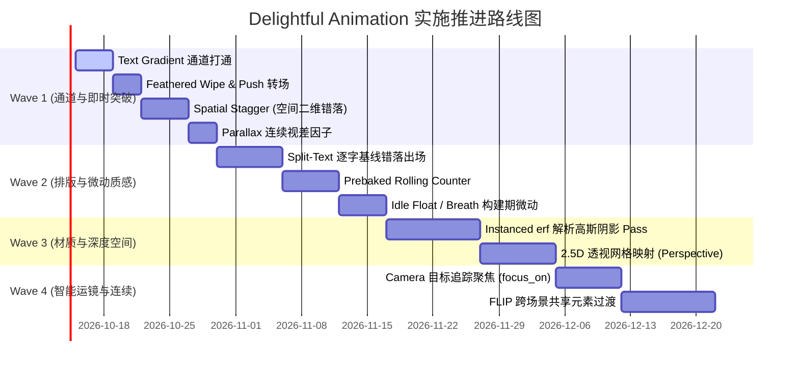

# Delightful Animation & Kinetic Design Plan (赏心悦目动效与动能排版架构规划)

> **状态**：设计提案与技术实施方案（2026-10-10）。
> **目标**：突破当前 Animatix 语言的“机械感 / AI味”，建立涵盖**动能排版**、**连续物理**、**材质光影**、**2.5D深度**、**智能运镜**与**无缝转场**的高级动效体系。
> **关联文档**：[`docs/spec.md`](spec.md), [`docs/architecture.md`](architecture.md), [`docs/roadmap.md`](roadmap.md), [`docs/ai_agent_animation_quality.md`](ai_agent_animation_quality.md)。

---

## 1. 现状审查与痛点诊断 (Audit Findings)

通过对现有代码库（`animatix-core`, `animatix-std`, `animatix-syntax`, `animatix-text`, `animatix`, `animatix-render`）及代表性案例（[`web/scenes/hero.amx`](../web/scenes/hero.amx), [`examples/gallery/motion_poster.amx`](../examples/gallery/motion_poster.amx), [`examples/animation/35_camera_moves.amx`](../examples/animation/35_camera_moves.amx)）的深度审查，当前动效能力存在以下核心瓶颈：

| # | 痛点表现 | 根本原因与代码证据 | 视觉缺陷后果 |
|---|---------|-------------------|-------------|
| **P1** | **排版表现力僵硬** | 1. `draw-in` 仅在 `dispatch.rs:514` 做粗暴的 `paths.truncate(n)` 数组截断；<br>2. 缺乏 Split-Text 原语，`motion_poster.amx` 被迫将单个单词拆成 6 个 `Text` 塞进 `Row`，**彻底摧毁了字距微调（Kerning）和合字**；<br>3. `fill_gradient` 在 `property.rs:349` 限制为 `AllShapesExceptLine`，文本无法使用渐变；<br>4. 计数器在 `always` 里每帧格式化，每帧击穿 `lock_compile_cache()` 导致全量字体解析。 | 标题文字毫无弹性与呼吸感，无法实现现代 SaaS / Apple 级的字符升起裁切与流光文字。 |
| **P2** | **物理断层与速度冲击** | 1. 新动作打断旧动作时（`actions/motion.rs:259`），仅采样位置点插入新缓动帧，**初速度强行归零或突变**（$C^0$ 连续但 $C^1$ 断裂）；<br>2. `Easing::Spring` (`easing.rs:159`) 初速度被写死为阻尼系数，无法传导惯性；<br>3. 缺乏跟随机制，`hero.amx` 中下划线与滑块必须手动硬编码相同时间/缓动/像素。 | 动作切换生硬机械，缺乏真实物体的惯性传递与次级运动（Secondary Motion）。 |
| **P3** | **材质与光影开销沉重** | 1. 卡片投影必须嵌套 `Filter` 作用域；每个 `Filter` 触发一次独立离屏 Vello 光栅化 + 3 次贴图拷贝 + 16-Tap 泊松圆盘 Compute 采样 + 1 次 Blit（`filter_backend.rs`），**完全无法 GPU 合并批处理**；<br>2. 场景树受限于 `kurbo::Affine` 纯 2D 仿射变换，无 2.5D 深度。 | 卡片缺乏层次悬浮感；少量卡片阴影即可导致 GPU 显存带宽击穿、帧率跌破 60fps。 |
| **P4** | **运镜脆弱与空间扁平** | 1. 镜头（`camera.rs`）缺乏声明式聚焦，`35_camera_moves.amx` 必须手动计算像素比例（`400 * 1.7 = 680`）；<br>2. `camera_follow` 是纯布尔值，缺乏连续视差系数。 | 运镜极难维护，画面缺少前景/中景/背景的纵深视差。 |
| **P5** | **转场硬边切割与场景割裂** | 1. `transition.rs:89` 的 Wipe 转场使用硬编码 `step()`，边缘呈现 1 像素锯齿硬切；<br>2. 跨场景切换时缺乏共享元素过渡（FLIP），页面元素无法跨场地位移。 | 场景切换具有强烈“PPT翻页感”，无法做到现代 UI 的流体无缝衔接。 |
| **P6** | **静止期死寂感** | 为图元添加持续微动必须在 `always` 中编写复杂的正弦波与 `fbm` 表达式，门槛高且每帧消耗解释器开销。 | 元素静止时呈现停滞感，缺乏生命力。 |

---

## 2. 核心工程铁律 (Engineering Invariants)

在进行设计与扩展时，必须严格遵守 Animatix 架构的以下铁律：

1. **无状态随机访问 (Stateless Random Access & Scrubbing)**：
   Animatix 的核心特性是多线程并发导出（单帧完全独立渲染）与时间轴任意点 Scrubbing。**严禁引入跨帧状态累积的隐式数值积分**（如基于上一帧速度累加的欧拉/Verlet 模拟）。一切物理与微动必须具备解析闭式解（Closed-form solution）或在构建期（Timeline Build）静态烘焙为关键帧。
2. **热路径零分配 (Zero-Alloc Hot Path)**：
   每帧求值（`evaluate_node`）严禁发生动态内存分配或昂贵的字符串解析。能在 Build 阶段解算的数据（如空间错落排序、文字预烘焙、引导轨道综合），绝不推迟到每帧执行。
3. **单一真相源与 ABI 稳定 (Single Source of Truth)**：
   新增属性必须按顺序追加至 `animatix-core::property::PROPERTY_DESCRIPTORS`，并同步更新 `raw_property_types` 与 `property_registry::BINDINGS`，绝不允许打破 Descriptor 索引。

---

## 3. 六大能力详细架构与实现可行性



---

### 方案一：动能排版与文字表现力 (Kinetic Typography)

#### 1.1 文本渐变填充 (Text Gradient)
*   **可行性**：**极高 / 低风险**（改动量 $\approx 80$ 行代码）。
*   **Vello 原生支持**：Vello 的 `scene.fill(..., brush, ..., &text_path.path)` 原生支持对任意 `kurbo::BezPath`（包括文字轮廓）传入 `peniko::Gradient`。
*   **落地实现**：
    1. **属性表解除限制**（`crates/animatix-core/src/property.rs`）：
       将 `fill_gradient`、`gradient_extend`、`gradient_space` 扩展为 `Applicable::Any(&[Applicable::AllShapesExceptLine, Applicable::TextLike])`。
    2. **声明解析打通**（`crates/animatix/src/timeline/declarations_text.rs`）：
       在文本属性声明循环中接收渐变表达式，写入 `track.style.fill_gradient`。
    3. **渲染命令扩展**（`crates/animatix/src/primitives/mod.rs`）：
       扩充 `RenderCommand::Text { paths, fill_gradient: Option<Box<GradientSpec>> }`。以整行文本的局部包围盒作为渐变坐标基准，将 `peniko::Gradient` 传入 Vello。

#### 1.2 Split-Text（逐字/逐词/逐行错落基线展开）
*   **可行性**：**高（推荐“程序化字形错落求值”方案）**。
*   **架构对比**：
    *   *弃用方案（时间轴子轨 Sub-tracks）*：为每个字符创建虚拟子 Actor，导致轨道数量成百倍暴增，破坏求值性能。
    *   *采纳方案（程序化字形求值 Procedural Glyph Stagger）*：
        1. **元数据轻量下沉**（`crates/animatix-text/src/lib.rs`）：
           在 `TextPath` 中增加轻量排版索引与几何中心（Fast Path 已经具备 `LineInfo` / `WordInfo`）：
           ```rust
           pub struct TextPath {
               pub path: BezPath,
               pub color: [u8; 4],
               pub opacity: f32,
               pub line_idx: u16,
               pub word_idx: u16,
               pub char_idx: u16,
               pub glyph_center: [f32; 2],
           }
           ```
        2. **时间轴单轨进度**（`crates/animatix/src/timeline/actions/reveal.rs`）：
           扩展动作修饰符：`draw-in [by: word, stagger: 40ms, offset_y: 24, mask: baseline]`，为目标分配一个 0.0~1.0 的整体进度轨。
        3. **帧求值仿射映射**（`crates/animatix/src/primitives/text.rs`）：
           求值阶段遍历各字形，字形序号 $k$ 根据全局进度 $P$ 计算局部归一化时间 $t_k = \text{clamp}\left(\frac{P - k \cdot \text{stagger}}{1 - (K-1)\cdot \text{stagger}}, 0, 1\right)$。
           得到 $\Delta y_k = (1 - \text{ease}(t_k)) \cdot \text{offset\_y}$ 与 $\text{opacity}_k = \text{ease}(t_k)$。
        4. **基线遮罩 (Baseline Mask)**：
           利用 Vello 原生的 `scene.push_layer(..., &line_clip_rect)`，字形从各自行基线下方升起时自动被下边缘切除，露显时恢复完整，**单帧开销 $< 0.02\text{ms}$**。

#### 1.3 预烘焙数值滚动计数器 (Rolling Counter / Odometer)
*   **可行性**：**高（构建期字形预烘焙 + Vello 图层槽位裁切）**。
*   **落地实现**：
    1. 新增 `Counter` 图元：在构建期**仅调用一次字体引擎**，提取 `0123456789,.-` 的贝塞尔曲线，统一列宽为等宽数字宽度 `col_width = max(advance(0..=9))`，彻底解决比例字体横向抖动。
    2. 连续滚动数学模型：各数位槽计算当前整数位 $d$、下一位 $d_{\text{next}}$ 与浮点小数值 $f = \text{fract}(v)$。
    3. 渲染阶段：为每个数位列执行 `scene.push_layer(..., &slot_rect)` 视口裁切，仅绘制当前数字（位移 $-f \cdot H$）与下一数字（位移 $(1-f) \cdot H$）。
    4. **性能收益**：彻底消除 `always` 导致的缓存击穿与 Typst 动态重排，**单帧耗时 $< 0.005\text{ms}$，实现 120fps 极速滚动**。

---

### 方案二：连续物理、编排与次级运动 (Continuous Physics & Choreography)

#### 2.1 连续初速度与弹簧接续 (Spring Handoff with Initial Velocity)
*   **可行性**：**中高（解析导数 + 投影标量初速度）**。
*   **解决问题**：打断运动时速度突变（$C^1$ 断裂）以及覆盖时间窗内的残留旧关键帧。
*   **落地实现**：
    1. **闭式导数求值**：在 `animatix-syntax/src/easing.rs` 中为所有缓动函数提供闭式导数 `easing_derivative(progress, easing) -> f32`。打断时刻 $t_0$ 采样前序动作末速度 $\vec{v}_0$。
    2. **主方向投影折算**：针对 2D 轨道 `[f32; 2]`，将矢量速度 $\vec{v}_0$ 投影到新动作的位移方向向量 $\vec{u} = \frac{\Delta \vec{X}}{\|\Delta \vec{X}\|}$ 上，折算为主方向的归一化标量初速度 $v_{0,\text{proj}} = \vec{v}_0 \cdot \vec{u}$。
    3. **解析初值解**：在 `Easing` 增加 `SpringV0 { damping, frequency, v0_norm }`：
       $$f(t) = 1 - e^{-\gamma t}\left(\cos(\omega t) + \frac{\gamma - v_{0,\text{norm}}}{\omega}\sin(\omega t)\right)$$
    4. **关键帧修剪**：打断插入关键帧时，通过 `keyframes.split_off(&t_start)` 剔除打断点之后被覆盖区间的旧关键帧。

#### 2.2 空间二维级联错落 (Spatial / Radial Stagger)
*   **可行性**：**极高 / 阻力最小**。
*   **关键发现**：在 Timeline Build 阶段，布局容器（`Grid`, `Row`, `Col`）在声明期已经执行了 Taffy 计算，各子图元的二维物理坐标 $(x, y)$ 已固化在 `track.geometry.position` 中。
*   **落地实现**：
    1. 语法扩展：`stagger [each: 40ms, from: center | top-left | (x, y), metric: euclidean | manhattan]`。
    2. 展开容器子节点并提取其 2D 布局中心坐标 $P_i$。
    3. 根据锚点 $P_0$ 计算各子图元空间距离 $D_i$（欧式距离 $\sqrt{\Delta x^2 + \Delta y^2}$ 或曼哈顿距离 $|\Delta x| + |\Delta y|$）。
    4. 按距离聚类分环（波前），同一环上的元素分配相同的起跳时间戳 $t_{\text{start}} + \text{ring} \cdot \text{interval\_ms}$，实现一键从中心向四周水波扩散出场。

#### 2.3 约束与跟随机制 (Lead-Follow via Build-time Track Synthesis)
*   **可行性**：**中（坚守构建期综合生成，拒绝运行时状态累积）**。
*   **解决痛点**：`hero.amx` 中滑块跟随下划线笔尖必须手动硬编码时间/缓动的脆断问题。
*   **落地实现**：
    1. 引入跟随语法：`follow carriage.at [target: underline.draw_tip, lag: 60ms, spring: (6, 9)]`。
    2. 在 Timeline 构建期，由于领头图元的轨道在整个时间跨度上是已知的解析函数，构建器对领头轨道进行采样，并在时域上施加时间延迟与阻尼卷积，**在构建期直接为跟随者综合生成一条独立的 `PropertyTrack`**。
    3. 运行时零开销，100% 保持无状态随机访问和多线程并发导出。

---

### 方案三：材质光影、2.5D深度与场景转场 (Materials & 2.5D)

#### 3.1 卡片原生解析高斯阴影 (Instanced erf Gaussian Shadow Pass)
*   **可行性**：**高（用解析闭式解取代 Compute 采样滤镜）**。
*   **解决痛点**：彻底摆脱 `Filter` + `DropShadow` 带来的离屏 Vello 光栅化、3 次纹理拷贝和 16-Tap 泊松采样开销。
*   **落地实现**：
    1. **解析数学解**：圆角矩形的高斯模糊卷积存在基于误差函数 $\text{erf}$ 的闭式有理近似解（Evan Wallace / IQ erf approximation）：
       $$I(x, y) = \frac{1}{4} \left[ \text{erf}\left(\frac{x - x_0}{\sqrt{2}\sigma}\right) - \text{erf}\left(\frac{x - x_1}{\sqrt{2}\sigma}\right) \right] \cdot \left[ \text{erf}\left(\frac{y - y_0}{\sqrt{2}\sigma}\right) - \text{erf}\left(\frac{y - y_1}{\sqrt{2}\sigma}\right) \right]$$
       片元着色器只需几条纯 ALU 计算即可得到精确透光率，**0 次纹理采样 (Zero Texture Fetches)**。
    2. **管线架构**（`crates/animatix-render/src/shadow_pass.rs`）：
       构建 `InstancedShadowPipeline`。每个带阴影的卡片只提交 40 字节 Instance 数据（中心、尺寸、圆角、偏移、$\sigma$、颜色）。
    3. **批处理优势**：在主 Vello 场景前，**单次 Draw Call 绘制全屏所有卡片的多层高斯阴影**，彻底消除性能瓶颈。

#### 3.2 2.5D 透视变换与倾斜 (Perspective & 3D Tilt)
*   **可行性**：**中（离屏子场景 + GPU 硬件齐次除法透视网格）**。
*   **Vello 约束**：Vello 纯 2D 仿射，不支持投影齐次除法 $w$。
*   **落地实现**：
    1. 声明 `rotate_x: deg(15)`, `rotate_y: deg(-20)`, `perspective: 800`。
    2. 带有 3D 旋转属性的节点在局部 2D 空间内光栅化至离屏纹理（复用现有的 `region_scratch`）。
    3. 构建 `PerspectiveBlitPipeline`：根据欧拉角和透视距离构建 $4\times 4$ MVP 矩阵，绘制双三角形 Quad。
    4. **利用 GPU 硬件光栅化器原生的透视矫正插值 ($\frac{uv}{w}$)**，硬件自动完成数学上完美的透视缩放与梯形贴图映射。

#### 3.3 柔和羽化与推挤转场 (Feathered Wipe & Push Transitions)
*   **可行性**：**极高 / 即刻落地**（改动量 $\approx 50$ 行代码）。
*   **落地实现**（`crates/animatix-render/src/transition.rs`）：
    1. **羽化擦除 (Wipe Feather)**：将 `step(edge, uv.x)` 替换为：
       ```wgsl
       let edge = select(uniforms.progress, 1.0 - uniforms.progress, ...);
       alpha = smoothstep(edge - uniforms.feather * 0.5, edge + uniforms.feather * 0.5, in.uv.x);
       ```
    2. **推挤转场 (Push)**：分别计算两张贴图的反向位移采样坐标：
       `uv_from = in.uv + vec2(progress, 0.0); uv_to = in.uv - vec2(1.0 - progress, 0.0)`。
    3. 在 `transition_registry.rs` 注册 `wipe-feather`, `push-left`, `push-right` 等枚举。

#### 3.4 跨场景共享元素过渡 (FLIP Transition)
*   **可行性**：**中高（世界状态采样 + 元素抑制 + 顶层浮动覆绘）**。
*   **解决痛点**：消除跨场景硬切与重影，实现类似移动端 Shared Element Transition。
*   **落地实现**：
    1. 语法：支持通用标记 `shared_id: "card_a"`。
    2. **世界状态采样 (First & Last)**：转场重叠期，通过 `resolve_actor_world_transform` 提取该元素在 Scene A 的世界矩阵 $M_A$、尺寸 $S_A$ 与 Scene B 的 $M_B, S_B$。
    3. **元素抑制 (Suppression Mask)**：渲染底层两个场景贴图时，临时将带有该 `shared_id` 的 Actor 标记为 `opacity = 0`（保留布局占位，但不输出绘制命令），杜绝重影。
    4. **浮动层覆绘 (Floating Overlay Pass)**：转场合成后，在顶部创建一个临时的覆盖层 Vello Scene，根据缓动曲线插值 $M(t) = \text{lerp}(M_A, M_B, p)$、尺寸与圆角，直接覆绘在合成贴图最上方。

---

### 方案四：智能运镜、视差与环境微动 (Camera, Parallax & Ambient Life)

#### 4.1 目标追踪运镜与视差分层 (Target-Tracking Camera & Parallax)
*   **可行性**：**极高 / 架构天然亲和**。
*   **落地实现**：
    1. **连续视差因子 (Parallax)**：将现有的 `camera_follow: bool` 升级为连续浮点数 `parallax: f32`（默认 1.0）。在 `scene_eval.rs:2199` 根节点遍历时，将根节点变换设为 `lerp(Affine::IDENTITY, camera_affine, parallax)`。背景设为 `0.2`，前景设为 `1.5`，两行代码即可解锁自然纵深。
    2. **声明式目标聚焦 (`camera.focus_on(card, padding: 40)`)**：在构建期查询 `card` 的包围盒中心与尺寸，自动反解并为 `camera.pan` 和 `camera.zoom` 合成关键帧，彻底免除手算像素比例的负担。

#### 4.2 声明式环境微动与粒子 (Ambient Float & Emitter)
*   **可行性**：**高（构建期周期关键帧烘焙 + 轻量点阵发射器）**。
*   **落地实现**：
    1. **声明式微动**：引入 `idle badge: float(y: 8, period: 3s), breath(scale: 1.02)`，构建期在 `motion_offset` 和 `scale` 轨道上按采样步长铺设无缝闭合的正弦关键帧，运行时零开销。
    2. **轻量点阵发射器 (Particle Emitter)**：引入专有 `Emitter` 图元，内部维护一组固定大小的紧凑粒子结构体数组，求值期直接以一条 `RenderCommand::Particles` 批量向 Vello 提交小圆点，每帧可吞吐 2000+ 微尘，杜绝为每个粒子创建独立 Actor 的巨大浪费。

---

## 4. 技术可行性与代价矩阵 (Feasibility & Cost Matrix)

| 特性方向 | 实施复杂度 | 关键涉及模块 | 运行期额外开销 | 视觉提升权重 |
| :--- | :--- | :--- | :--- | :--- |
| **羽化/推挤转场 (Feather & Push)** | ⭐ (极低) | `transition.rs`, `transition_registry.rs` | 0 (纯 Shader 替换) | 4.0 / 5.0 |
| **文本渐变 (Text Gradient)** | ⭐ (极低) | `property.rs`, `declarations_text.rs`, `primitives/mod.rs` | 0 (Vello 原生支持) | 4.5 / 5.0 |
| **空间错落 (Spatial Stagger)** | ⭐⭐ (低) | `sequence.rs`, `timing.rs` | 0 (纯构建期计算) | 4.5 / 5.0 |
| **视差分层与聚焦 (Parallax & Focus)** | ⭐⭐ (低) | `camera.rs`, `scene_eval.rs` | 0 (仿射矩阵插值) | 4.5 / 5.0 |
| **滚动数字 (Rolling Counter)** | ⭐⭐ (中低) | `primitives/counter.rs`, `animatix-std` | 极低 ($<0.005\text{ms}$) | 4.5 / 5.0 |
| **环境呼吸微动 (Ambient Float)** | ⭐⭐ (中低) | `actions/effects.rs`, `motion_offset` | 0 (构建期烘焙关键帧) | 4.0 / 5.0 |
| **Split-Text (逐字错落出场)** | ⭐⭐⭐ (中) | `animatix-text`, `reveal.rs`, `text.rs` | 极低 ($<0.02\text{ms}$) | **5.0 / 5.0 (天花板级)** |
| **卡片原生阴影 (Instanced erf Shadow)** | ⭐⭐⭐ (中) | `shadow_pass.rs`, `offscreen.rs`, `property.rs` | 极低 (单次 Instanced Draw) | **5.0 / 5.0 (天花板级)** |
| **连续初速度 (Spring Handoff)** | ⭐⭐⭐ (中) | `property_track.rs`, `easing.rs`, `actions/motion.rs` | 0 (构建期计算) | 4.0 / 5.0 |
| **2.5D 透视倾斜 (Perspective Tilt)** | ⭐⭐⭐ (中) | `perspective_blit.rs`, `scene_eval.rs` | 低 (轻量离屏 + 2 Triangles) | 4.5 / 5.0 |
| **共享元素转场 (FLIP Transition)** | ⭐⭐⭐⭐ (中高)| `composition/`, `offscreen.rs`, `scene_eval.rs` | 低 (抑制 + 顶层单图元覆绘) | **5.0 / 5.0 (天花板级)** |

---

## 5. 四阶段实施路线图 (Phased Implementation Roadmap)



### Wave 1: 语法通路打通与即时视觉突破（周期：1~2周）
*   **交付物**：
    1. `Text Gradient`：文本支持 `fill_gradient`，完成 Headline 视觉质感升级。
    2. `Feathered Wipe & Push`：转场着色器支持边缘羽化与推挤位移，彻底消除硬切割感。
    3. `Spatial Stagger`：支持网格容器根据子节点坐标自动径向波浪扩散出场。
    4. `Parallax Factor`：根节点支持浮点数连续视差系数。
*   **验收标准**：更新 `motion_poster.amx` 与转场 Demo，验证视觉表现。

### Wave 2: 排版动能化与微物理基础（周期：2~3周）
*   **交付物**：
    1. `Split-Text`：支持 `draw-in [by: word, stagger: 40ms, mask: baseline]`，废弃人工拆字 Row 的 hack 写法。
    2. `Rolling Counter`：内置 `Counter` 图元，预烘焙 0-9 等宽字形，彻底解决 KPI 场景卡顿与抖动。
    3. `Idle Float / Breath`：声明式环境微动，构建期铺设计算，消除静态画面死寂感。
*   **验收标准**：重写 `dashboard_story.amx` 的指标跳变动效，验证 60fps+ 无掉帧。

### Wave 3: 材质突破与空间深度（周期：3~4周）
*   **交付物**：
    1. `Instanced erf Shadow`：新增 `elevation` 属性，构建单 Pass 解析高斯阴影管线，淘汰多层 `DropShadow` 离屏滤镜。
    2. `2.5D Perspective Tilt`：支持 `rotate_x`, `rotate_y`, `perspective`，实现卡片悬浮翻转效果。
*   **验收标准**：单场景渲染 20 个带多层高斯阴影与倾斜的卡片，帧耗时控制在 $12\text{ms}$ 以内。

### Wave 4: 镜头智能化与无缝连续性（周期：3~4周）
*   **交付物**：
    1. `Smart Camera`：支持 `camera.focus_on(actor)` 自动解算变焦与构图。
    2. `FLIP Transition`：支持跨场景同名或 `shared_id` 标记图元的平滑无缝位移过渡。
*   **验收标准**：编写跨场景多视图联动 Demo，实现从卡片列表到详情卡片的无缝展开。
